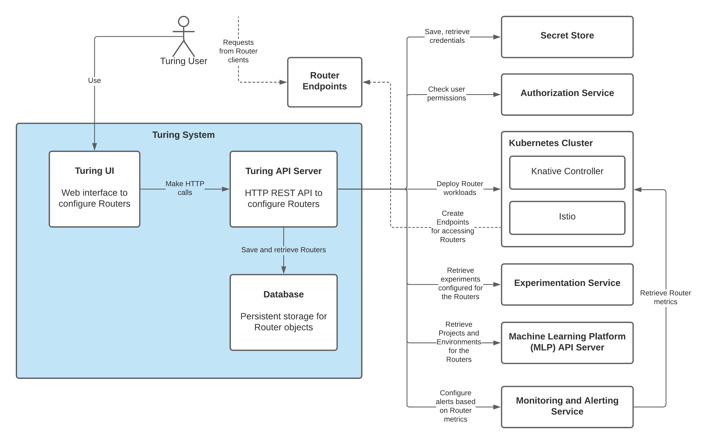
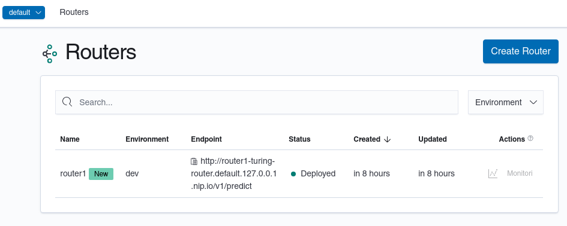
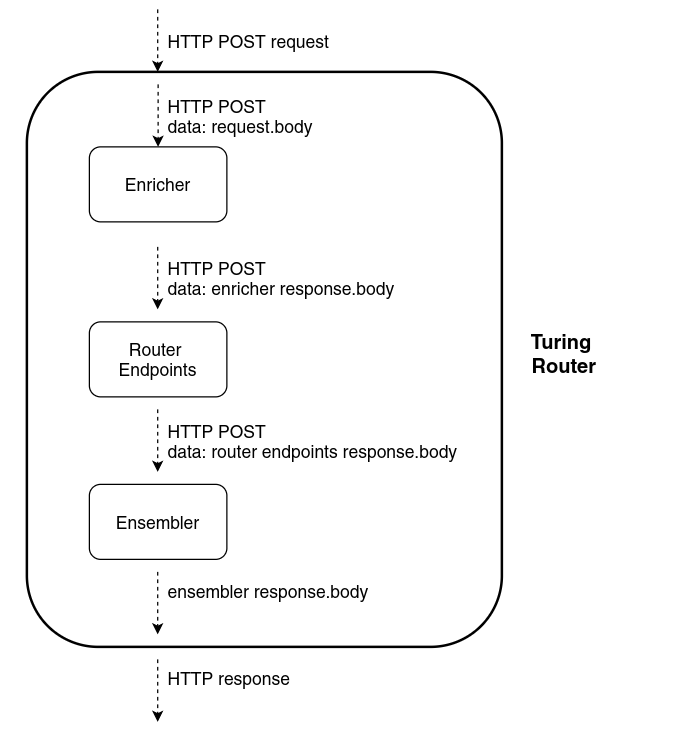

# Turing

Turing is a fast, scalable and extensible system that can be used to design, deploy and evaluate ML experiments in production. 

## Architecture Overview

The following diagram shows the high level overview of the Turing system. Users
configure Turing routers from the Turing UI. Turing API creates the required
workloads and components to run Turing routers. The Turing router will be
accessible from the Router endpoint after a sucessful deployment. Requests to the
Turing router will be served in real time.
Turing also provides an ensembling job runner that can be run in batches instead 
of real time.



Turing contains these main components:
- API server
- Router engine
- Experiment engine
- Batch ensembler engine
- UI web application

Refer to the README under the individual directories for getting started with the respective components:
```
.
├── api 
├── engines
│   ├── experiment 
│   ├── router
│   └── batch-ensembler
└── ui 
```

## Getting Started

The following guide will help you quickly get started with running Turing.
Turing requires these infrastructure dependencies in order to function properly:
- [MLP](https://github.com/gojek/mlp) API server to namespace Turing routers
- [Merlin](https://github.com/gojek/merlin) API server to manage environments where Turing routers are deployed
- [Kubernetes](https://kubernetes.io/) cluster (with [Knative Serving](https://knative.dev/docs/serving/) and [Istio](https://istio.io/) installed and [Spark on K8s Operator](https://github.com/GoogleCloudPlatform/spark-on-k8s-operator)) to provision and manage Turing router workloads (Note that our local setup does not install Spark on K8s Operator as of writing)
- [Vault](https://www.vaultproject.io/) to store deployment and user secrets

For ease of setup, we will use [Docker compose](https://docs.docker.com/compose/) to install the infrastructure 
in these getting started guide.

> Note that this guide is only suitable for development purpose. For production, 
> you will need to deploy the infrastructure using an approach that ensures
> the services are scalable and reliable. For instance, using cloud provider
> services such as Google Kubernetes Engine (GKE) for provisioning the Kubernetes cluster.
>
> The following guides are tested on Linux and MacOS.

### Pre-requisites

- [Docker](https://www.docker.com/get-started) v19.03
- [Docker compose](https://docs.docker.com/compose/) v1.27
- [Go](https://golang.org/dl/) v1.14
- [Node.js](https://nodejs.org/en/download/) v14 and npm v6
- [Kubectl](https://kubernetes.io/docs/tasks/tools/install-kubectl/) v1.19 (optional)
- Local ports 80, 8080, 8081, 8082, 8200, 5000, 6443 should be available

### Download Turing Source Code

Download Turing source code to your local filesystem. From here onwards
the environment variable `$TURING` will refer to the root directory
for the Turing source code.
```bash
git clone https://github.com/gojek/turing.git
export TURING=$PWD/turing
```

### Setup Local Infrastructure with Docker Compose

Start all the required background services in Docker compose.
```bash
cd $TURING/infra/docker-compose/dev
docker-compose up -d
```

Make sure that all the services in Docker compose are in state **Up** or **Exit 0**
as shown below. It may take a few minutes for all services to start sucessfully,
depending how fast all the dependencies are downloaded.

```bash
docker-compose ps

           Name                         Command               State                Ports            
----------------------------------------------------------------------------------------------------
dev_agent_1                  /bin/k3s agent                   Up                                    
dev_agent_2                  /bin/k3s agent                   Up                                    
dev_agent_3                  /bin/k3s agent                   Up                                    
dev_istio_1                  bash -ec cp /.kube/kubecon ...   Exit 0                                
dev_knative_1                bash -ec cp /.kube/kubecon ...   Exit 0                                
dev_kubeconfig_1             cp /.kube/kubeconfig.yaml  ...   Exit 0                                
dev_local-registry_1         /entrypoint.sh /etc/docker ...   Up       0.0.0.0:5000->5000/tcp       
dev_merlin-postgres_1        /opt/bitnami/scripts/postg ...   Up       5432/tcp                     
dev_merlin_1                 merlin_api                       Up       0.0.0.0:8082->8080/tcp       
dev_mlp-init_1               sh -ec curl \                    Exit 0                                
                               --fail -X  ...                                                       
dev_mlp-postgres-init_1      sh -ec migrate -path=/db-m ...   Exit 0                                
dev_mlp-postgres_1           /opt/bitnami/scripts/postg ...   Up       5432/tcp                     
dev_mlp_1                    mlp                              Up       0.0.0.0:8081->8080/tcp       
dev_server_1                 /bin/k3s server --disable  ...   Up       0.0.0.0:6443->6443/tcp,      
                                                                       0.0.0.0:80->80/tcp           
dev_turing-postgres-init_1   sh -ec migrate -path=/db-m ...   Exit 0                                
dev_turing-postgres_1        /opt/bitnami/scripts/postg ...   Up       0.0.0.0:5432->5432/tcp       
dev_vault-init_1             sh -ec wget https://github ...   Exit 0                                
dev_vault_1  
```

If the service does not start/complete succesfully (for example if the state is stuck
at **Restarting**), check the logs to debug it.
```bash
# For example, to check the logs for the Vault service in Docker compose
docker-compose logs vault
```

The Docker compose includes a helper service that writes the Kubernetes config
in `/tmp/kubeconfig`. This is required to access the Kubernetes cluster. You can verify
that Istio and Knative are setup successfully.
```bash
export KUBECONFIG=/tmp/kubeconfig
# All should be in "Running" status
kubectl get pod -A
```

> NOTE:
> In order to stop all the services in Docker compose, run the following
> `docker-compose down -v`. You will run this command as well to clean
> up the infrastructure installed from Docker compose.

### Build Turing Router Docker image

In order to deploy Turing router on Kubernetes, we need a Turing router Docker
image. We are going to build the Docker image and push it to the local registry
(this registry was part of the service started in Docker compose)

```bash
cd $TURING/engines/router
go mod vendor
docker build -t localhost:5000/turing-router .
docker push localhost:5000/turing-router
```

### Start Turing API server

Now, we have all the necessary infrastructure and dependencies to start Turing 
API server. Turing API server handles HTTP requests to manage Turing routers.
```bash
cd $TURING/api
```

The file `$TURING/api/config-dev.yaml` specifies the configuration for the Turing API server.
Notice that we specify the addresses for MLP API server, Merlin API sever and
Vault to reference the services started from the Docker compose. Also, Turing
router Docker image is set to the image built and push from the previous step.

```yaml
# config-dev.yaml
BatchRunnerConfig:
  TimeInterval: 10s
DbConfig:
  User: turing
  Password: turing
DeployConfig:
  EnvironmentType: dev 
EnsemblingJobConfig:
  DefaultEnvironment: dev
  RecordsToProcessInOneIteration: 10
  MaxRetryCount: 3
  ImageBuilderConfig:
    Registry: ghcr.io
    BaseImageRef: ghcr.io/gojek/turing/batch-ensembler:latest
    BuildNamespace: default
    BuildContextURI: git://github.com/gojek/turing.git#refs/heads/main
    DockerfileFilePath: engines/batch-ensembler/app.Dockerfile
    BuildTimeoutDuration: 20m
  KanikoConfig:
    Image: gcr.io/kaniko-project/executor
    ImageVersion: v1.5.2
    ResourceRequestsLimits:
      Requests:
        CPU: "1"
        Memory: 1Gi
      Limits:
        CPU: "1"
        Memory: 1Gi
  DefaultConfigurations:
    SparkConfigAnnotations:
      "spark/spark.sql.execution.arrow.pyspark.enabled": "true"
    BatchEnsemblingJobResources:
      DriverCPURequest: "1"
      DriverMemoryRequest: "1Gi"
      ExecutorReplica: 2
      ExecutorCPURequest: "1"
      ExecutorMemoryRequest: "1Gi"
KubernetesLabelConfigs:
  Environment: dev
SparkAppConfig:
  CorePerCPURequest: 1.5
  CPURequestToCPULimit: 1.25
  SparkVersion: 2.4.5
  TolerationName: batch-job
  SubmissionFailureRetries: 3
  SubmissionFailureRetryInterval: 10
  FailureRetries: 3
  FailureRetryInterval: 10
  PythonVersion: "3"
  TTLSecond: 86400
RouterDefaults:
  Image: localhost:5000/turing-router
VaultConfig:
  Address: http://localhost:8200
  Token: root
TuringEncryptionKey: password
MLPConfig:
  MerlinURL: http://localhost:8082/v1
  MLPURL: http://localhost:8081/v1
  MLPEncryptionKey: password
TuringUIConfig:
  AppDirectory: ../ui
  Homepage: /turing
```

Now, start Turing API server with `go run` command,
```bash
go run turing/cmd/main.go -config=config-dev.yaml
```

We will create a new router with name `router1`. This router specifies [httpbin](http://httpbin.org/anything) as
the router endpoint. No enricher and ensembler are configured in the router. 

Run the following in a new terminal to create a new router.
```bash
curl --request POST 'localhost:8080/v1/projects/1/routers' \
--header 'Content-Type: application/json' \
--data-raw '{
    "environment_name": "dev",
    "name": "router1",
    "config": {
        "routes": [
            {
                "id": "control",
                "type": "PROXY",
                "endpoint": "https://httpbin.org/anything",
                "timeout": "5s"
            }
        ],
        "default_route_id": "control",
        "experiment_engine": {"type": "nop"},
        "resource_request": {"min_replica": 1},
        "timeout": "5s",
        "log_config": {"result_logger_type": "nop"}
    }
}'
```

After a few minutes, check the status of the new Turing router deployed. Make 
sure the status is `deployed`. Then, we can try making a request to the Turing
router.
```bash
# Ensure that it returns "status: deployed"
curl --request GET 'localhost:8080/v1/projects/1/routers/1' | grep status

# Make request to the router endpoint
curl --request GET 'http://router1-turing-router.default.127.0.0.1.nip.io/v1/predict'
```

If everything runs correctly, you should receive a response like so, showing
that Turing router succesfully calls the route to httpbin URL.
```json
{
  "args": {}, 
  "data": "", 
  "...": {},
  "url": "https://httpbin.org/anything"
}

```

> If router status is `failed`, you can check the log from the API server.
> Also, you can check the error from Kubenetes by creating 
> a new router (with a different name). Then run `kubectl get pods` and 
> `kubectl describe pod <POD_NAME>` to check the reason why the workloads failed to start successfully.

### Start Turing UI 

Turing UI is a React web app that helps end users use Turing easily. Currently it requires
Google OAuth2 for setting up user identities. You need to first set up the required Google OAuth2
client ID. Please follow this [documentation](./ui/README.md#setup-google-oauth2) for more details.

Create `.env` file for local development. This file will be loaded when you
start Turing UI web app in development mode.
```bash
cd $TURING/ui
touch .env.development.local
```

Then, update the config file `.env.development.local` as shown below. 

> Replace `xxxxxxx.apps.googleusercontent.com` with your respective Google OAuth2 client ID.

```
REACT_APP_HOMEPAGE=/turing
REACT_APP_TURING_API=http://localhost:8080/v1
REACT_APP_MLP_API=http://localhost:8081/v1
REACT_APP_MERLIN_API=http://localhost:8082/v1
REACT_APP_OAUTH_CLIENT_ID=xxxxxxx.apps.googleusercontent.com
REACT_APP_DEFAULT_DOCKER_REGISTRY=docker.io
```

Now we can start Turing API React application. By default, it will listen on port 3001.
```bash
npm install
npm start
```

Open http://localhost:3001/turing on your default web browser. Login
with the Google account allowed in your Google OAuth2 setup.
The web UI allows you list, create, edit and delete your routers from the 
web browser.



## Turing Router Components

Turing router can optionally be configured with **enrichers** and **ensemblers**.
Enrichers can process and update the request body before they reach the configured router
endpoints. Ensemblers can process and update the response body from the router endpoints, 
before the response is sent to the Turing router client. These allows users to customize
the behaviour of Turing routers.



## Contributing

Please refer to [contributing guide](./CONTRIBUTING.md).
