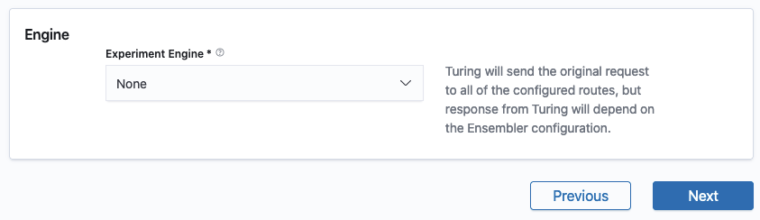

# Configure Experiment Engine


This step is **optional** and the default behaviour will be to send the request to all of the configured routes, but the response from Turing will depend on the Ensembler configuration.


If you intend to determine how to select/combine responses from the individual routes (typically in the Ensembler) to send back as the Turing response, configure the Experiment Engine as shown in Configure Experiment Engine. 

