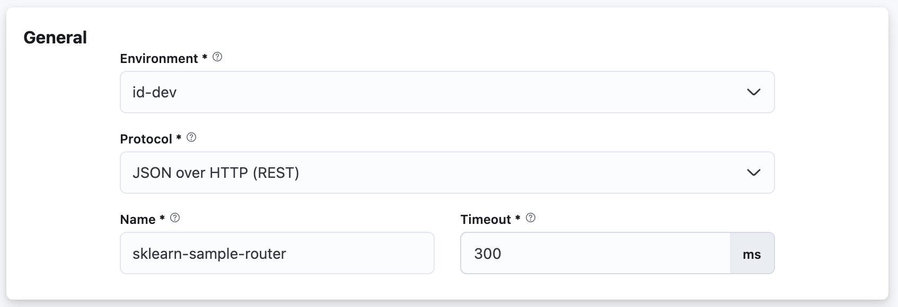

# Configuring General Settings

There are 3 required inputs:

1. Environment: Target environment your router will be deployed to.

2. Name: Name of your router deployment.

3. Timeout: Overall timeout, which when exceeded, the request execution by your Turing router will be terminated.

