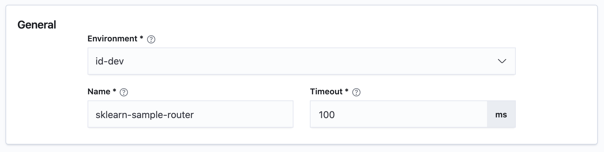

# Configuring General Settings

There are 3 required inputs:

**Environment**: Target environment your router will be deployed to.

**Name**: Name of your router deployment.

**Timeout**: Overall timeout, which when exceeded, the request execution by your Turing router will be terminated.

