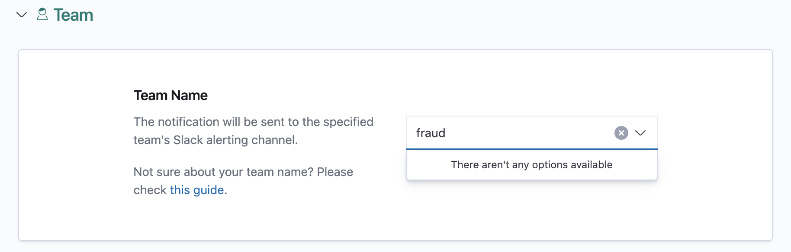
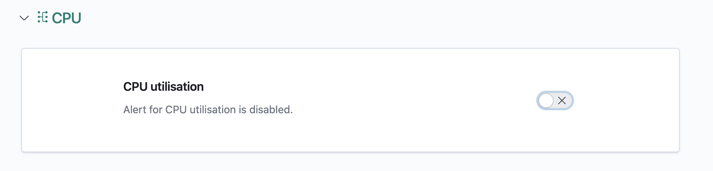
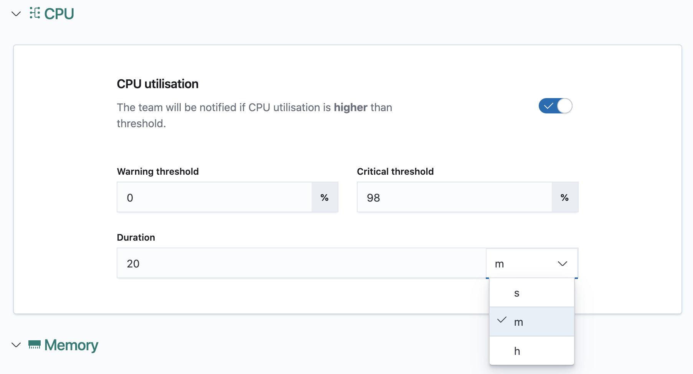
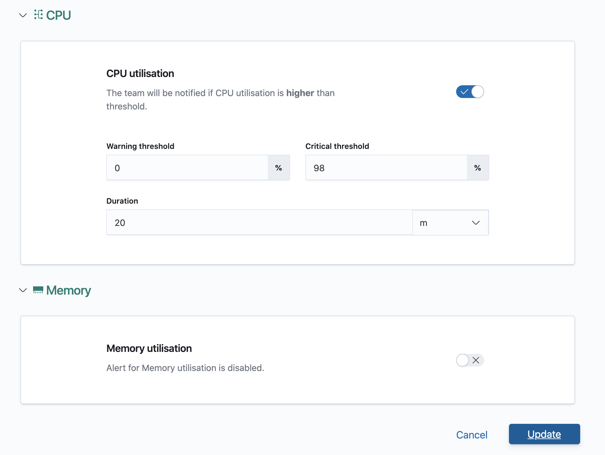
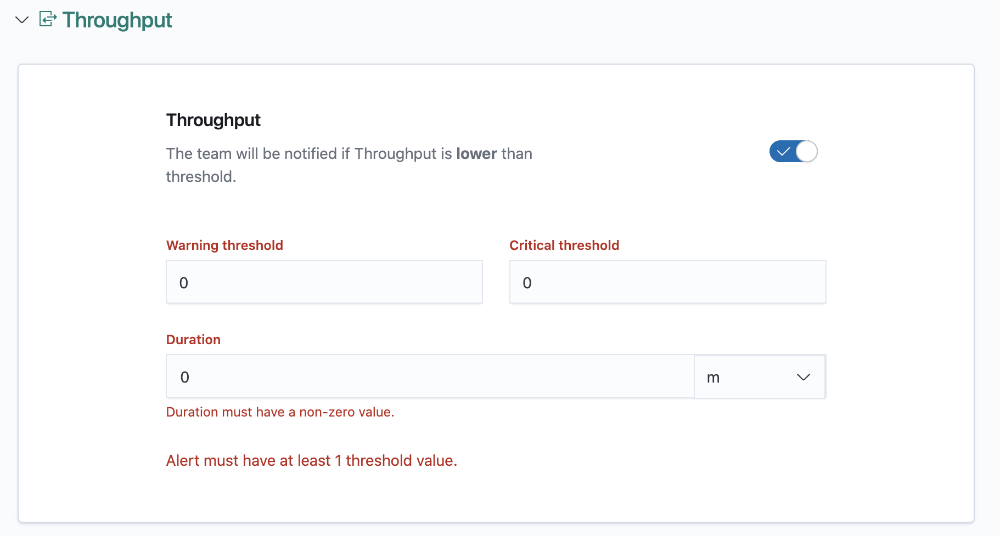
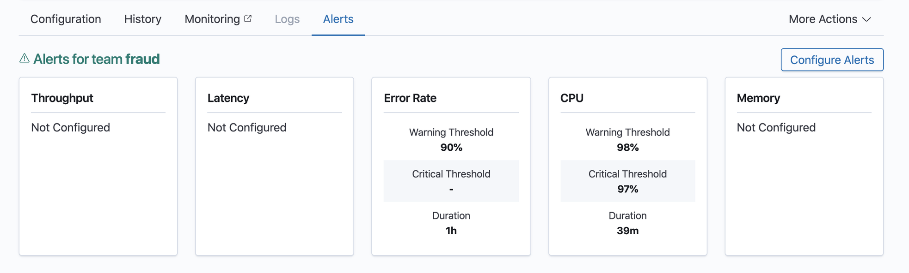

# Configuring Alerts

You can configure alerts for the critical metrics of your deployed router. An alert will be fired to the configured team’s slack channel if a metric is out of range.

Navigate to the router details view of your router.

Click on the Alerts Tab and then, the Configure Alerts button.

Select a team that must be informed of any alerts associated with your router.  You can choose a provided team from the dropdown or enter a custom team.  You will only be able to configure a **single team** for all your alerts.

Enable the alert by toggling the switch of the metric you want to be alerted for.

Configure the details of the alert.

**Threshold**: Fill in either the `warning threshold` or `critical threshold` values, or both. You will need to fill in at least one threshold value. If not, disable the alert by toggling the switch.

**Duration**: Enter the duration value and select a duration unit, for when metric has been consistently out of the allowed range, an alert will be fired. This field is required.

Click update alerts.

If there is an error in validation, you will be taken back to the first section with an error and will be able to see all the errors in the form. You will need to rectify all errors before clicking on the Update button again.

    
Once the alerts have been successfully validated and configured, you will be taken to the alerts details page and will see the alerts you have configured.

