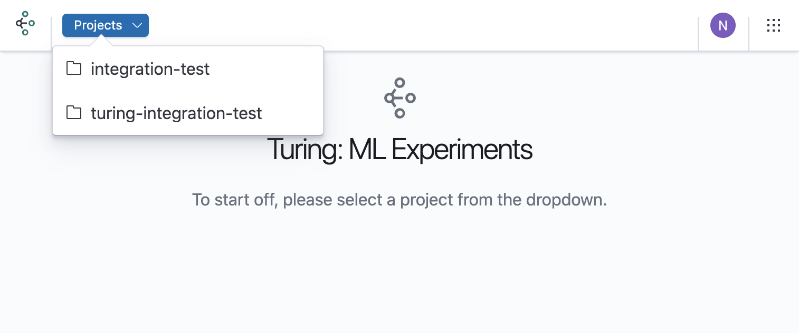
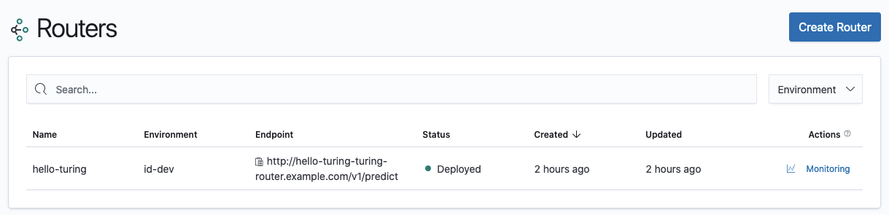

# Create a router

A Router in the Turing system represents an ML experiment and holds the configuration for the traffic routing, pre/post-processors, incorporating the response from the Experiment engine and logging. It is built on our Fiber traffic routing library written in Golang, and sources its configuration when it starts up.

### Setting Up An Experiment

In Turing, your will need to create a router with an optional Experiment Engine, Pre-processor (Enricher) and Post-processor (Ensembler) configured based on your requirements. After configuring and deploying the router, you will receive a URL to which you are able to send your experimentation requests.

### Navigate to the Create Router UI
* Open the Turing homepage.

* Choose a project in which you want to create your router. 
If such a project does not exist, you can [create a project](../create-project.md)

* Choose “Create Router”. 

### Configure router

Now that we have navigated to the create a router page, we can continue to configure the router.









