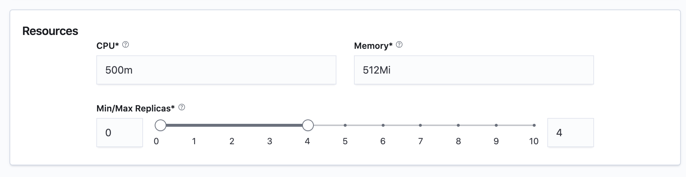

# Configure autoscaling

You can also configure the amount of resources (CPU/Memory) allocated for each replica of your router as well as lower and upper limits for the autoscaling.


In most situations, 500m CPU and 0.5Gi memory should suffice, however, you can fine tune this configuration based on the data from Turing monitoring dashboard.


## Autoscaling Policy

By default, Turing uses request concurrency as a measure to monitor performance. For situations that require more fine-grained control, you can also choose a different autoscaling metric and adjust the target value according to prior load tests.

Currently, 4 metrics are supported - Concurrency, RPS, CPU and Memory.

