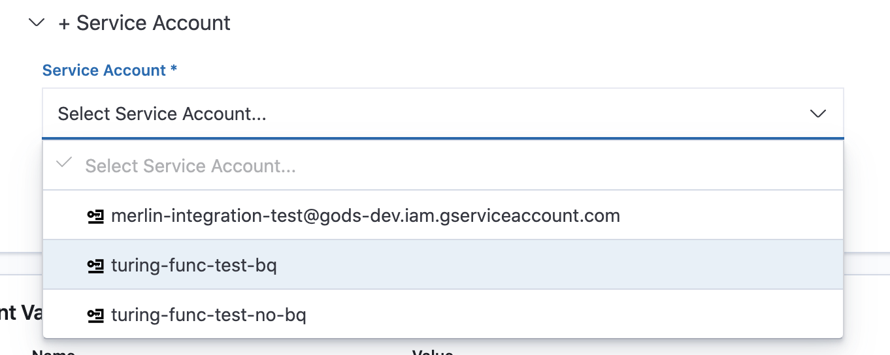

# Configure Enricher


This step is **optional** and the default behaviour will send the original request to the configured routes.


The Turing enricher has the ability to perform arbitrary transformations on the incoming request for feature enrichment. It can deploy any enricher image (implemented by a user) and integrate it with the rest of the system.  Currently, there are 3 options available - no enricher, Docker and an external enricher coming soon.

### No Enricher
Original request will be sent to configured routes without enrichment.

### Docker
Turing will deploy specified Docker image as a pre-processor and will send original request to it for enrichment. To configure a Docker enricher, there are 3 sections to fill.  

Configure the Docker Container. There are 4 required inputs.

**Docker Image**: The image is formed of 2 parts. Select the registry to where your image is stored. Following that, enter the name of the image.  

**Endpoint**: Relative URL endpoint of the enricher.

**Port**: Port number exposed by your container.

**Timeout**: Request timeout, which when exceeded, the request to enricher will be terminated

**Service Account**: You can **optionally** mount a service account for your Docker deployment.

Configure any environment variables required by the docker container. You need to input the name and corresponding value of each input.

Configure the resources required for the enricher. There are 3 required inputs, with default values provided for each.

**CPU**: Total amount of CPU available for your enricher.

**Memory**: Total amount of RAM available for your enricher.

**Min/Max Replicas**: Min/max number of replicas for your enricher. Scaling of the enricher based on traffic volume will be automatically done for you.

### External Enricher

Coming soon.
