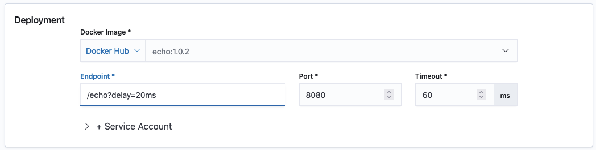
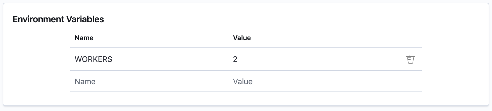
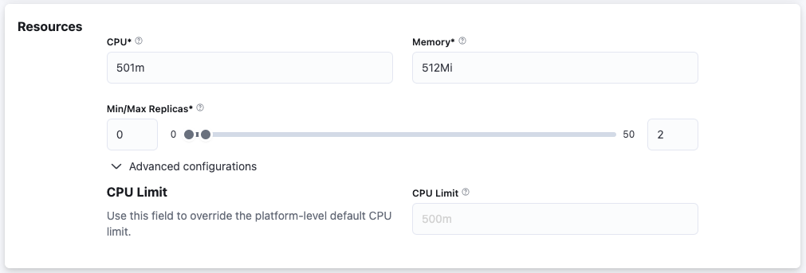
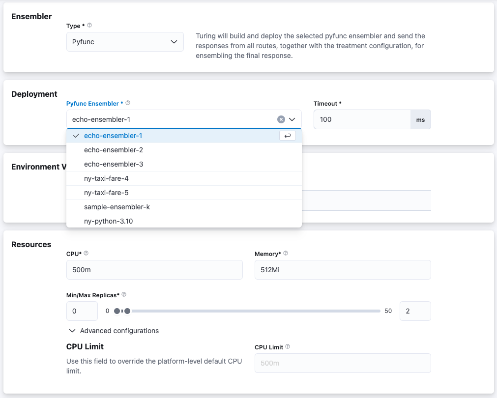

# Configure Ensembler


This step is **optional** and the default behaviour will be to return the response from the default route.


Turing currently supports ensemblers in the same fashion as the enrichers. The ensembling is controlled by the policy from the rule engine.

Currently, there are 4 options available - no ensembler, a standard ensembler, Docker and an external ensembler.

## No Ensembler
The router will return a response from the default route, specified in Configure Routes. This option is available only when **no experiment engine** is configured in Configure Experiment Engine.

## Docker
Turing will deploy specified image as a post-processor and will send the original request, responses from all routes, and the treatment configuration (if a Experiment Engine is selected, in Configure Experiment Engine), for ensembling. To configure a Docker ensembler, there are 3 sections to be filled.

Configure the Docker Container. There are 4 required inputs.



**Docker Image**: The image is formed of 2 parts. Select the registry to where your image is stored. Following that, enter the name of the image.

**Endpoint**: Relative URL endpoint of the ensembler.

**Port**: Port number exposed by your container.

**Timeout**: Request timeout, which when exceeded, the request to the ensembler will be terminated

**Service Account**: You can **optionally** mount a service account for your Docker deployment.

Configure any environment variables required by the Docker container. You need to fill in the name and corresponding value of each input.



Configure the resources required for the ensembler. There are 3 required inputs, with default values provided for each.<br/>



**CPU**: Total amount of CPU available for your ensembler.

**Memory**: Total amount of RAM available for your ensembler.

**Min/Max Replicas**: Min/max number of replicas for your ensembler. Scaling of the ensembler based on traffic volume will be automatically done for you.

## Pyfunc Ensembler
Turing will deploy a pre-deployed pyfunc ensembler (refer to 
[the samples](https://github.com/gojek/turing/tree/main/sdk/samples) in the SDK section for more information on how to 
deploy one) as a containerised web service. 

This allows you to simply define the logic required for the ensembling 
step by implementing a Python `mlflow`-based interface, and rely on Turing API to containerise and package your 
implementation as an entire web service automatically.

To configure your router with a Pyfunc ensembler, simply select from the drop down list your desired ensembler 
registered in your current project. You'll also need to indicate your desired timeout value and resource request values:



**Pyfunc Ensembler**: The name of the pyfunc ensembler that has been deployed in your *current* project 

**Timeout**: Request timeout, which when exceeded, the request to the ensembler will be terminated

**CPU**: Total amount of CPU available for your ensembler.

**Memory**: Total amount of RAM available for your ensembler.

**Min/Max Replicas**: Min/max number of replicas for your ensembler. Scaling of the ensembler based on traffic volume will be automatically done for you.

## External Ensembler
Coming Soon.

The router will send responses from all routes, together with treatment configuration to the external URL for ensembling.


## Ensembler Request Payload Format
When the ensembler type is Docker/External, the ensembler will receive the following information in the request payload and the behaviour of the ensembler is up to the implementer.

```json
{
  // original request payload unmodified
  "request":{},
  "response": {
    "route_responses": [
      {
        "route": "control",
        "data": {
          //...
        },
        "is_default": true
      },
      {
        "route": "xgboost-ordinal",
        "data": {
          //...
        }
      },
    ],
    "experiment": {
      // response from Experiment Engine unmodified
      "configuration": {
          //...
      },
      // populated if error occurs
      "error": "",
    }
  }
}
```
