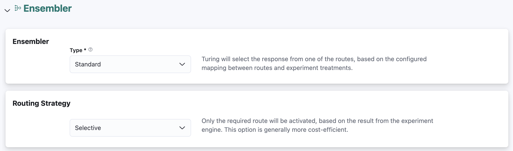

# Configure Ensembler

Turing currently supports ensemblers in the same fashion as the enrichers. The ensembling is controlled by the policy from the rule engine.

Currently, there are 4 options available - no ensembler, a standard ensembler, Docker and Pyfunc ensembler.

## No Ensembler
The router will return a response from the route configured to act as the final response. This option is available only when **no experiment engine** is configured in Configure Experiment Engine.



It is not possible to select as the final response a route that has traffic rules associated to it.


## Standard Ensembler

There are two types of Standard Ensemblers available, one that is available with Standard Experiment Engines that 
have experiment selection enabled, and the other with Custom Experiment Engines. Both types of standard ensemblers support
two modes of routing - 'Selective' (where the experiment engine is called upfront, and only the route that will be chosen
as the final response will be invoked), and 'Exhaustive' (where all applicable routes and the experiment engine will be
called in parallel) - the former is more cost efficient while the latter is more performant.


### Standard Experiment Engines
For routers configured with Standard Experiment Engines that have experiment selection enabled, the router will return a response from one of the routes based on the configured mapping between routes and experiment treatments. At run time, the treatment returned by the engine will be used to select the corresponding route’s response.



In addition, a fallback route may be configured whose results will be used at runtime when the call to the experiment engine fails or if a route mapping for the treatment generated by the experiment engine does not exist.



It is not possible to select as the fallback response a route that has traffic rules associated to it.


### Custom Experiment Engines
For routers configured with Custom Experiment Engines, the router will return a response from one of the routes 
corresponding to the route name that is found within the treatment configuration returned by the experiment 
engine. At run time, the router will attempt to access the route name within the treatment configuration received via a 
user-configured path. 

A fallback route also has to be configured in order to capture cases whereby the route name found in the treatment 
configuration does not correspond to any of the routes configured, or when the user-configured path is invalid with 
respect to the treatment configuration received.

## Docker

Turing will deploy the specified image as a post-processor and will send in the request payload the following, for 
ensembling - the original request, responses from all routes, and the treatment configuration (if an Experiment 
Engine is selected, in the Configure Experiment Engine step). The ensembler's request headers will contain the original 
request headers sent to Turing, merged with the enricher's response headers (if there are duplicates, the value in 
the enricher's response headers will take precedence), and an identifier `Turing-Req-Id` that is uniquely assigned to each request received by the Router. 

To configure a Docker ensembler, there are 3 sections to be filled.

Configure the Docker Container. There are 4 required inputs.


**Docker Image**: The image is formed of 2 parts. Select the registry to where your image is stored. Following that, enter the name of the image.

**Endpoint**: Relative URL endpoint of the ensembler.

**Port**: Port number exposed by your container.

**Timeout**: Request timeout, which when exceeded, the request to the ensembler will be terminated

**Service Account**: You can **optionally** mount a service account for your Docker deployment.

Configure any environment variables required by the Docker container. You need to fill in the name and corresponding value of each input.


Configure the resources required for the ensembler. There are 3 required inputs, with default values provided for each.<br/>


**CPU**: Total amount of CPU available for your ensembler.

**Memory**: Total amount of RAM available for your ensembler.

**Min/Max Replicas**: Min/max number of replicas for your ensembler. Scaling of the ensembler based on traffic volume will be automatically done for you.

Optionally, modify the autoscaling policy on the ensembler.


**Metric**: The autoscaling metric to monitor. Currently, 4 metrics are supported - Concurrency, RPS, CPU and Memory.

**Target**: The target value of the chosen metric for each replica, after which autoscaling should be triggered.

## Pyfunc Ensembler
Turing will deploy a previously registered Pyfunc ensembler (refer to 
[the samples](https://github.com/caraml-dev/turing/tree/main/sdk/samples) in the SDK section for more information on how to 
deploy one) as a containerised web service. 

This allows you to simply define the logic required for the ensembling 
step by implementing a Python `mlflow`-based interface, and rely on Turing API to containerise and package your 
implementation as an entire web service automatically.

Similar to requests sent to a Docker Ensembler, the request payload sent to a Pyfunc ensembler will contain the 
original request, responses from all routes, and the treatment configuration (if an Experiment
Engine is selected, in the Configure Experiment Engine step). The ensembler's request headers will contain the original
request headers sent to Turing, merged with the enricher's response headers (if there are duplicates, the value in
the enricher's response headers will take precedence), and an identifier `Turing-Req-Id` that is uniquely assigned to each request received by the Router.

**Note on compatibility**: The Pyfunc servers are compatible with `protobuf>=3.12.0,<5.0.0`. Users whose ensemblers have a strong dependency on Protobuf `3.x.x` are advised to pin the library version in their conda environment, when submitting the ensembler. If using Protobuf `3.x.x` with the UPI protocol, users can do one of the following:
* Use `protobuf>=3.20.0` - these versions support simplified class definitions and this is the recommended approach.
* If you must use `protobuf>=3.12.0,<3.20.0`, please pin `caraml-upi-protos<=0.3.6` in your ensembler’s conda environment.

To configure your router with a Pyfunc ensembler, simply select from the drop down list your desired ensembler, 
registered in your current project. You'll also need to indicate your desired timeout value and resource request values:


**Pyfunc Ensembler**: The name of the Pyfunc ensembler that has been deployed in your *current* project 

**Timeout**: Request timeout, which when exceeded, the request to the ensembler will be terminated

**CPU**: Total amount of CPU available for your ensembler.

**Memory**: Total amount of RAM available for your ensembler.

**Min/Max Replicas**: Min/max number of replicas for your ensembler. Scaling of the ensembler based on traffic volume will be automatically done for you.

Optionally, modify the autoscaling policy on the ensembler.


**Metric**: The autoscaling metric to monitor. Currently, 4 metrics are supported - Concurrency, RPS, CPU and Memory.

**Target**: The target value of the chosen metric for each replica, after which autoscaling should be triggered.

## External Ensembler
Coming Soon.

The router will send responses from all routes, together with treatment configuration to the external URL for ensembling.


## Ensembler Request Payload Format
When the ensembler type is Docker/Pyfunc/External, the ensembler will receive the following information in the request 
payload and the behaviour of the ensembler is up to the implementer.

```json
{
  // original request payload unmodified
  "request":{},
  "response": {
    "route_responses": [
      {
        "route": "control",
        "data": {
          //...
        }
      },
      {
        "route": "xgboost-ordinal",
        "data": {
          //...
        }
      },
    ],
    "experiment": {
      // response from Experiment Engine unmodified
      "configuration": {
          //...
      },
      // populated if error occurs
      "error": "",
    }
  }
}
```
