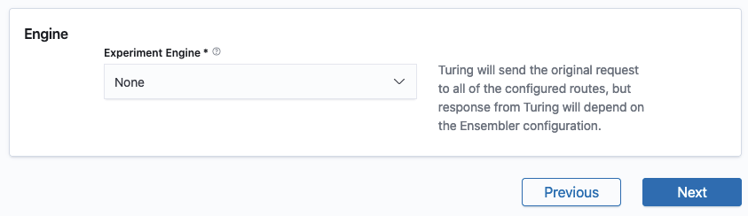

# Configure Experiment Engine


This step is **optional** and the default behaviour will be to send the request to all of the configured routes, but the response from Turing will depend on the Ensembler configuration.


The request sent to the experiment engine is constructed from the request headers to the Router (including an
identifier `turing_req_id` that is uniquely assigned to each request received by the Router), and either the request 
body to the Router (if there is no Enricher) or the response body from the Enricher (if enabled).

If you intend to determine how to select/combine responses from the individual routes (typically in the Ensembler) to send back as the Turing response, configure the Experiment Engine as shown in Configure Experiment Engine. 

