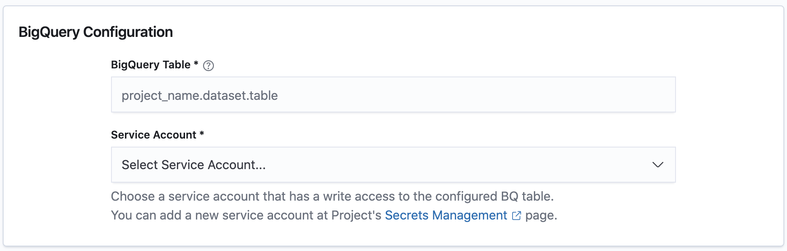
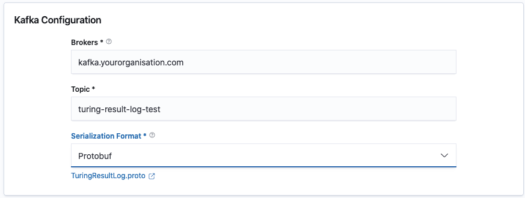

# Logging Response/Request


This step is **optional** and the default behaviour is not to log any request-response pair.


Turing currently supports logging request-treatment-response data to BigQuery and Kafka.

## BigQuery

Configure the BigQuery destination. There are 2 required inputs.

**BigQuery Table**: Specify the name of the BigQuery Table in the format of `project_name.dataset.table`. If the table does not exist, it will be created automatically at the deployment.

**Service Account**: Choose a service account from the ones provided that has both JobUser and DataEditor privileges and write access to the configured BigQuery dataset.

## Kafka

Select Kafka as the Results Logging Destination and configure the required values.

**Brokers**: A comma-separated list of one or more Kafka brokers

**Topic**: A valid Kafka topic name on the server. The data will be written to this topic.

**Serialization Format**: The message serialization format to be used. This can be JSON or Protobuf. When Protobuf serialization is used, the message published to the topic is of type `TuringResultLogMessage` and the message key is of type `TuringResultLogKey`. When JSON serialization is used, the `TuringResultLogMessage`'s JSON representation is published to the topic. The protocol buffers can be found [here](https://github.com/caraml-dev/turing/blob/main/engines/router/missionctl/log/resultlog/proto/turing/TuringResultLog.proto).
