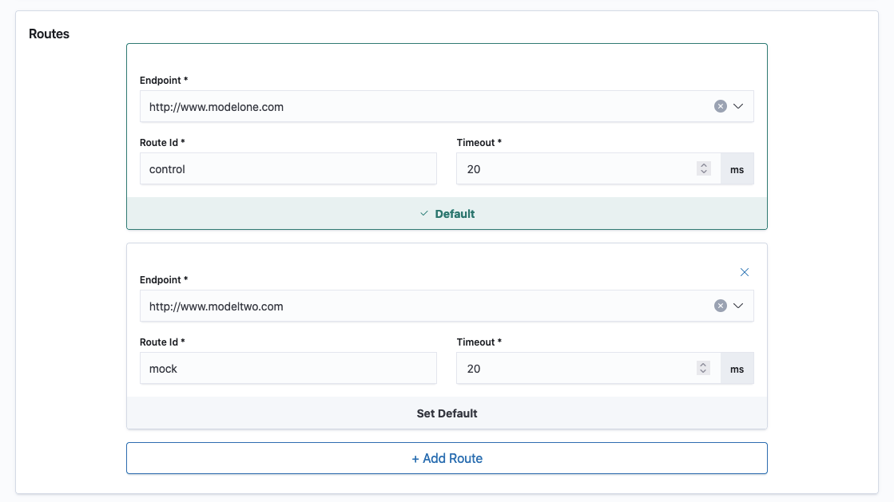

# Configure routes

Routes are an essential part of your Turing Router setup. Each route is defined by its ID and the endpoint. A route can be your deployed ML model, exposed via HTTP interface, or an arbitrary non-ML web-service. Each router should be configured with at least one route and each route's ID should be unique among other routes of this router.


You should also configure timeouts for each of the routes. The request execution will be terminated, when this timeout is exceeded during a call from Turing to the route's endpoint.

