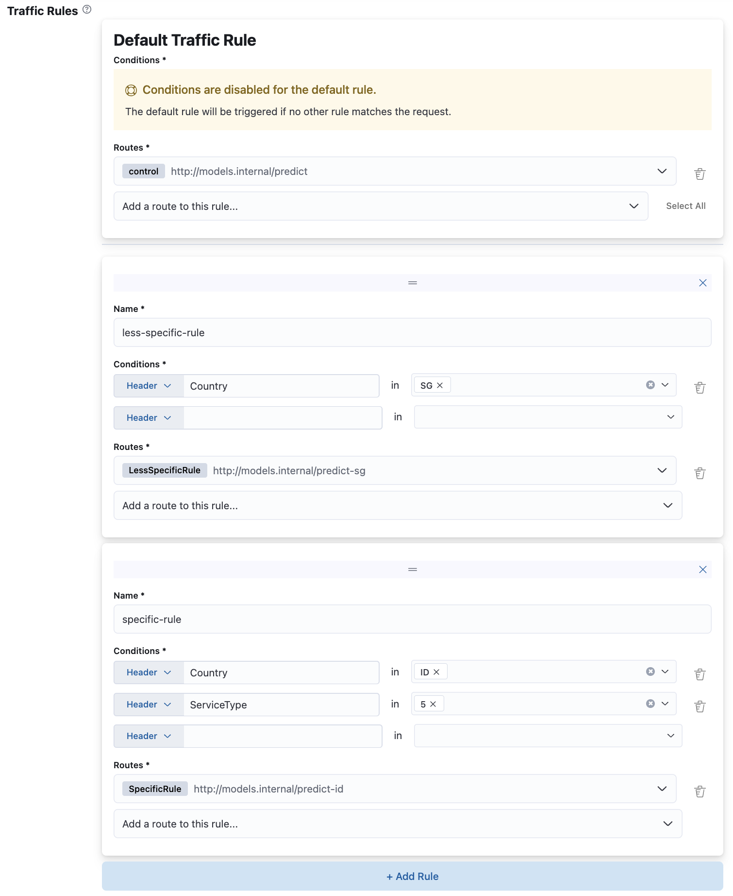

# Traffic Rules


This step is **optional** and the default behaviour will not discriminate between requests.



It is also possible to configure your router such that each request is only dispatched to a subset of the configured routes, based on some request specific conditions. For example, you might have some models, trained on geography-specific data. So, in this scenario, you want to call `mock` if the request contains header `"X-Region: region-A"` or `model-b` if `X-Region` header equals `"region-B"`. It's possible to achieve this by configuring traffic rules on your router.

**Note**: Nested paths in the payload can be specified using `.` as the separator. This also works for array
indices. Eg: The first session id in the below structure can be specified as `session.[0].id`.

```json
{
  "session": [
    {"id": 123, "data": {}},
    {"id": 456, "data": {}}
  ]
}
```

Traffic rules define which routes should be "activated" for a particular request to your router. Each rule is defined by one or more request conditions and one or more routes that would be activated if the request satisfies the conditions of the rule. 

When traffic rules are configured, the following behaviour is expected:
- A Default traffic rule is required, which has no request conditions and acts as a fallback rule for requests that don't match any of the configured traffic rule conditions. At least 1 route should be configured for the Default traffic rule.
- All routes should be used by at least 1 traffic rule, i.e no dangling routes.
- When a Nop or Standard Ensembler is configured (See: [Configure Ensembler](./configure-ensembler.md)), the final/fallback route must be present in every traffic rule, including the default rule.

Rules are matched against the incoming request in the order in which they are defined. The UI supports the drag-and-drop functionality to reorder priority of the rules. This property can be used to create one or more specific rules over a general rule. Consider the following example, where a router has rules defined such that requests are routed by the country of origin (ID, SG, etc.). In addition, if the routing logic must be altered for a certain service type in a country, this rule (the 'specific' rule) can be defined before the general rule.



In addition, orthogonality checks have been put in-place to disallow overlapping rules. Some examples are as described below:

| Rule | Conditions |
|------|------------|
| 1    | country_code=[ID], geo_area=[1] |
| 2    | country_code=[ID,SG], geo_area=[1,2,3] |
| 3    | country_code=[SG], geo_area=[1] |
| 4    | country_code=[ID], geo_area=[2] |

From the above rules, rule 2 is overlapping with all other rules since there are no unique combinations that would let rules 3 and 4 to be called, and rule 2 will not be called for the same conditions met by rule 1.

| Rule | Conditions |
|------|------------|
| 1    | country_code=[ID], geo_area=[1] |
| 2    | country_code=[SG], geo_area=[1] |

From the above rules, both rule 1 and 2 are not overlapping because there's at least 1 condition parameter i.e country_code that is exclusive.

### Conditions

Each rule should have at least one condition configured on it. If there are multiple conditions configured on the same rule, then this rule will be triggered only if each and every condition is satisfied. Rule condition can be defined on either request header or request payload (assuming payload is a valid JSON object). For each condition you should specify:

* **Condition source**: either `Header` or `Payload`
* **Condition key**: if condition's source is `Header` – then the name of a request Header (example: `X-Session-ID`), or else, if condition's source is `Payload` – a valid JSON path of the property from the request's JSON payload (example: `service_type.id` or `users.0.name`)
* **Condition values**: one or more values that the extracted condition key is expected to match. Condition will be satisfied if key matches at least one of the configured values.<br/>


Provided values are case-sensitive.


### Routes   

You should also select one or more routes from the drop-down list that would be activated if the rule is triggered. A route can be attached to zero or more traffic rules.

* If a route is attached to some traffic rule, then Turing will only send request to this route if the request meets this rule's conditions.
* If a route is attached to multiple rules and the request satisfies more than one rule, then Turing will decide what group of routes should receive this request based on the order in which the traffic rules are defined.
