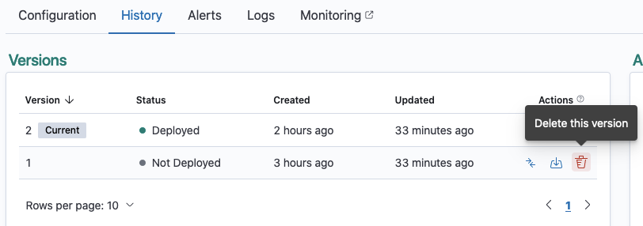
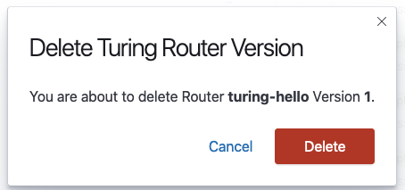
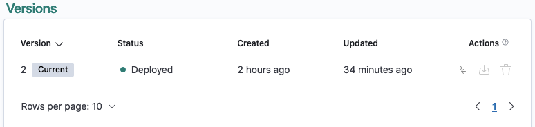

# Deleting a Router Version

Any version that is not currently deployed or in the process of deployment can be deleted. This action will remove the version from the router’s history and can no longer be accessed.  

Navigate to the Router Details View of your router.

Click on the History tab.

Only a version that is **not currently deployed** (indicated by the absence of the `Deployed` status) can be deleted. If you would like to see the details of your router version before deleting, proceed to Deleting a Router Version from Version Details View. If not, click on the Delete button of the version you would like to delete in the Actions column.

Confirm if you want to delete the specified version of your router.

Once the specified version has been successfully deleted, you will no longer be able to see the deleted version in the History tab.

