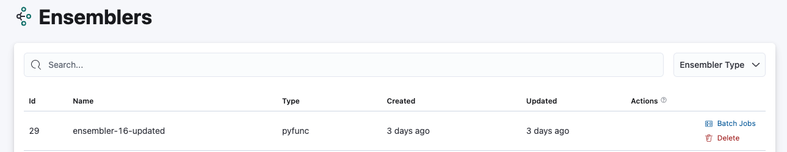
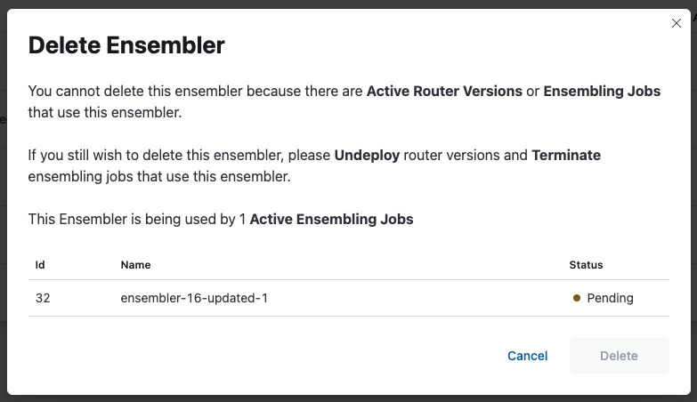

# Deleting an Ensembler with related active entity

An Ensembler only could be deleted if there are no active ensembling jobs or router versions that use the ensembler. This page shows the deletion of ensembler **with related active entity** (ensembling job and router version).

Ensembler with related active router versions or ensembling jobs can not be deleted. Ensembler that is currently used by a router also can not be deleted.

Navigate to Ensemblers page

Click on the delete button 

The ensembler can not be deleted since there are active router versions or ensembling jobs using the ensembler. Hence, the dialog will show the related entity that block the deletion process.

If you still wish to delete the ensembler, please follow notes on the dialog. Since there are multiple constraint for the ensembler deletion process.