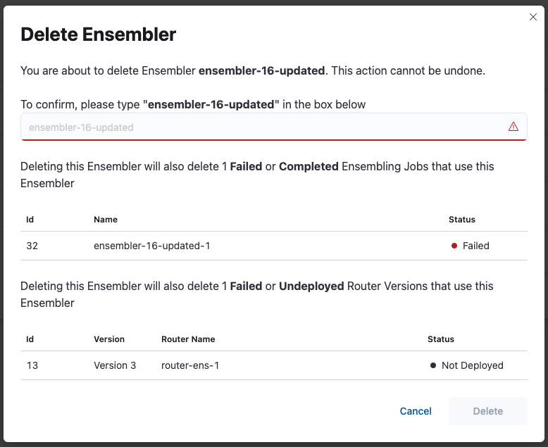
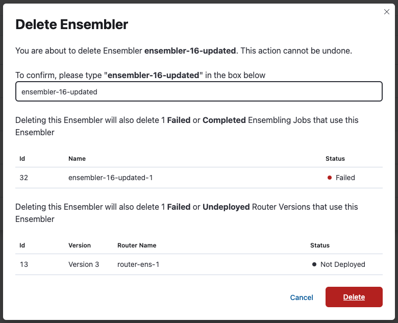
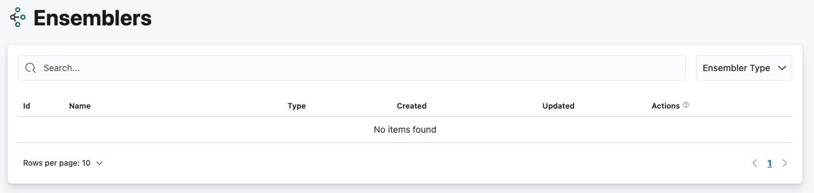

# Deleting an Ensembler with related inactive entity

An Ensembler only could be deleted if there are no active ensembling jobs or router versions that use the ensembler. This page shows the deletion of ensembler **with related inactive entity** (ensembling job and router version).

Deleting the ensembler will also delete any inactive entity related to the ensembler

Navigate to Ensemblers page

Click on the delete button 

The Dialog will show related entity that are going to be deleted following the deletion of the ensembler. The router versions and the ensembling jobs shown on the popup will get deleted since both are inactive.

Please type the ensembler name for confirmation

Once the specified ensembler has been successfully deleted, you will no longer be able to see the ensembler on the ensembler page.

