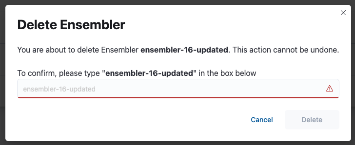
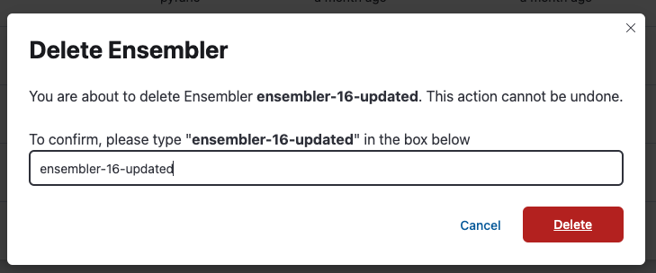

# Deleting an Ensembler without any related entity

This page describes the process of deleting an ensembler **without any related entities** (ensembling jobs or router versions).

Navigate to the Ensemblers page. Click on the 'Delete' button:

Type the ensembler's name in the text bar to confirm your decision:

Once the specified ensembler has been successfully deleted, you will no longer be able to see the ensembler on the Ensemblers page:

