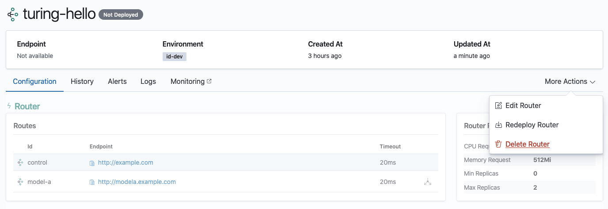
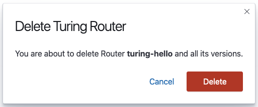
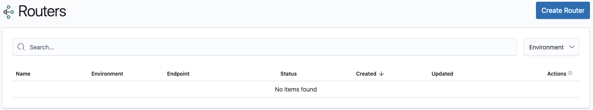

# Deleting Routers

A router that is not currently deployed or in the process of deployment can be deleted. This action will remove the router from the Turing database and the router and all associated versions can no longer be accessed.

Navigate to the Router Details View of your router.

Click on the More Actions button and select Delete Router. 

Only a router that is **not currently deployed or in the process of deployment** (indicated by the absence of `deployed` and `updating` status badges) can be deleted. If you want to delete a router that is currently deployed, undeploy your router first.

Confirm if you want to delete the router.

Once the router has been successfully deleted, you will be taken to Routers List View and will no longer be able to see the router in the list.

