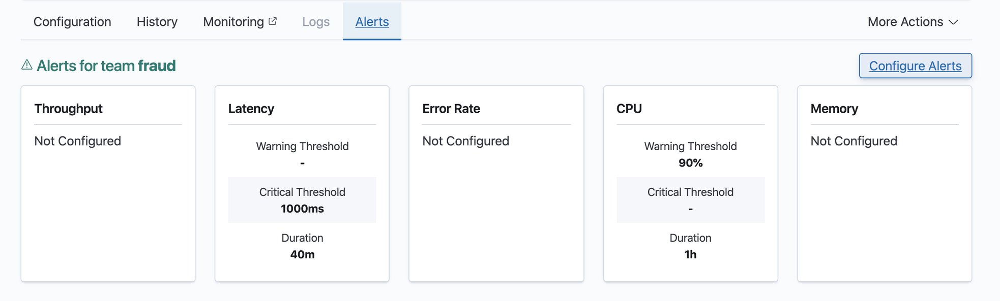
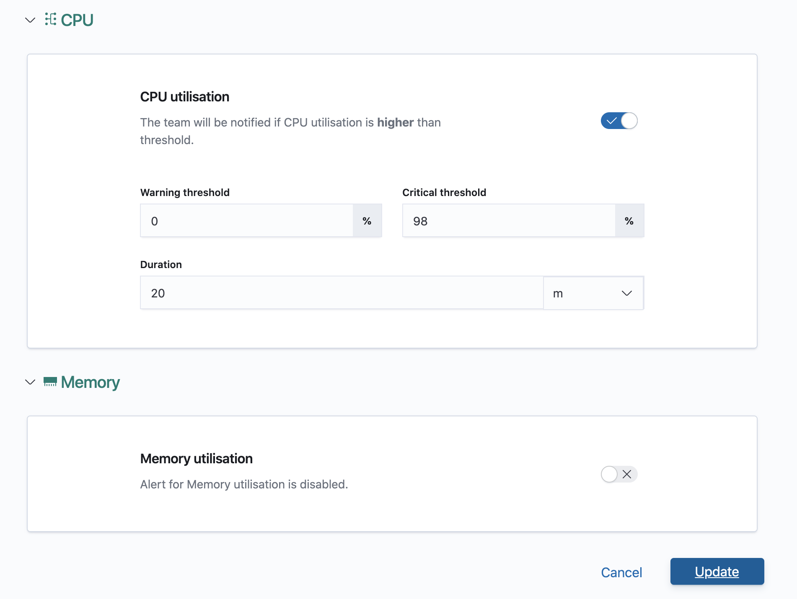
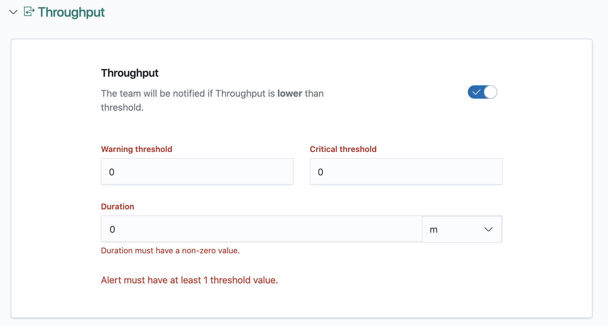
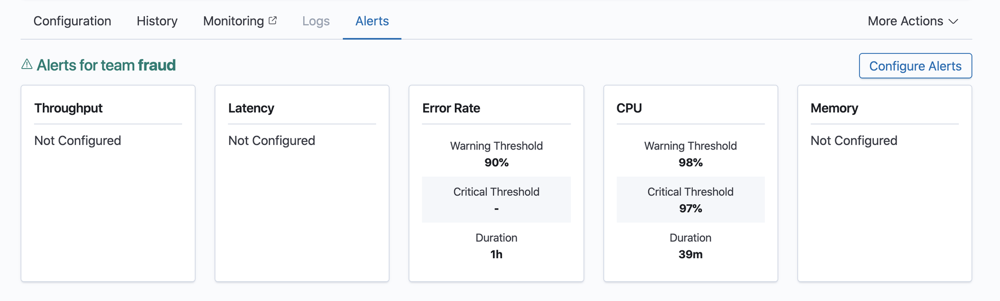

# Configuring Alerts


This document assumes that an appropriate alerting solution has been integrated to the deployment of Turing.
The actual functionality may be different, according to the specific deployment configurations.


You can configure alerts for the critical metrics of your deployed router. 
An alert will be fired if a metric is out of range, to the destination set up in the alerting backend.

1. Navigate to the Router Details View of your router.

2. Click on the Alerts Tab and then, the Configure Alerts button.

3. Select a team that must be informed of any alerts associated with your router. 
You can choose a provided team from the dropdown or enter a custom team. 
You will only be able to configure a **single team** for all your alerts.

4. Enable the alert by toggling the switch of the metric you want to be alerted for.

5. Configure the details of the alert.

6. Click on Update Alerts.

    1. If there is an error in validation, you will be taken back to the first section with 
    an error and will be able to see all the errors in the form. You will need to rectify all 
    errors before clicking on the Update button again.
    
    
7. Once the alerts have been successfully validated and configured, you will be taken to the 
Alerts Details page and will see the alerts you have configured.

