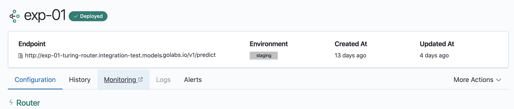
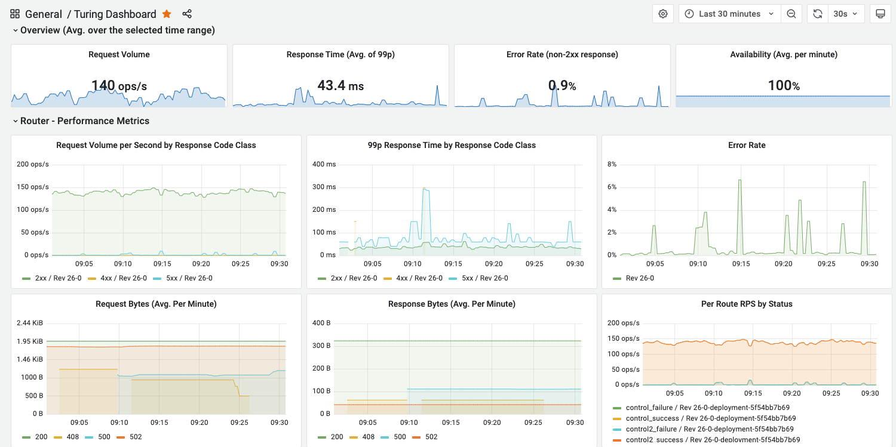

# Monitoring Router Performance


This document assumes that an appropriate monitoring solution has been integrated to the deployment of Turing.
The actual functionality may be different, according to the deployment configurations.


1. Navigate to the Router Details View of your router.

2. Click on the monitoring link of your router under Router Actions.

3. This link will bring you to the Lens dashboard with standard router metrics such as 
throughput, latency and error rate of your Router.

