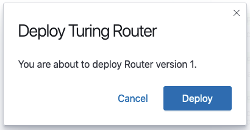

# Redeploy a router version from version details page

Clicking on the row of your version in the history tab will bring you to the version details page. You should be able to see the existing version configuration here.

Within the More Actions panel, click Deploy This Version.

Confirm if you want to deploy the specified version of your router.

 
Once the specified version is in the process of redeployment, the status of the version will be changed to Updating and it will be in the process of deploying your router.

