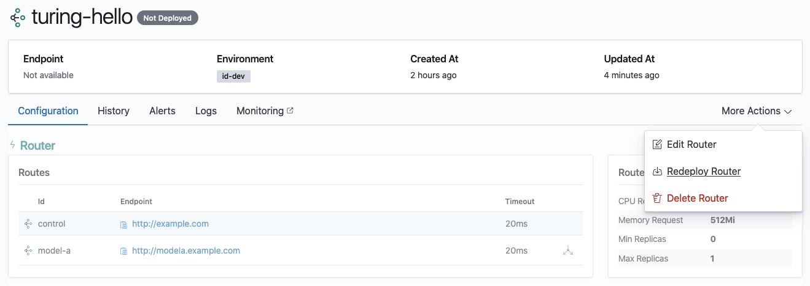
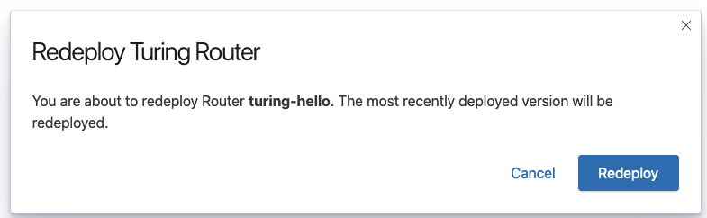
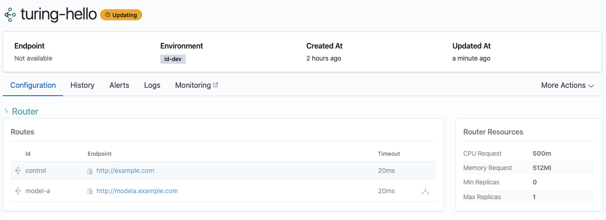

# Redeploy an undeployed router

Navigate to the Router Details View of your router.

Click on the More Actions button and select Redeploy router. 

Only an **undeployed** router (indicated by the router status `Not deployed`) can be redeployed and Turing will automatically redeploy the most recently deployed version for you. If you want to deploy a different version, proceed to Redeploy a Valid Version.

Confirm if you want to redeploy your router.

Once the router is in the process of redeployment, you will see that the status of your router has changed from `Not deployed` to `Updating`. 

