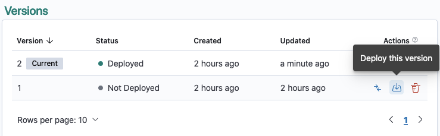
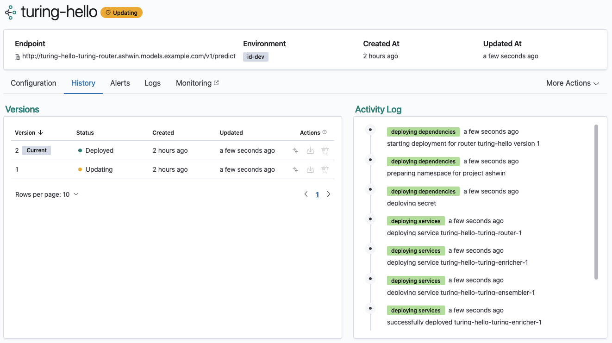

# Redeploy a router version history tab

Navigate to the Router Details View of your router and click the `history` tab.

Only a version that is not currently deployed (indicated by the `Not Deployed` version status) can be deployed. If you would like to see the details of your router version before deploying, proceed to deploy a router version from version details page. If not, click on the deploy button.

Confirm if you want to deploy the specified version of your router.

Once the specified version is in the process of the redeployment, you will be taken to the Version Details View of the deploying version and the status of the version will be changed to `Updating`.

