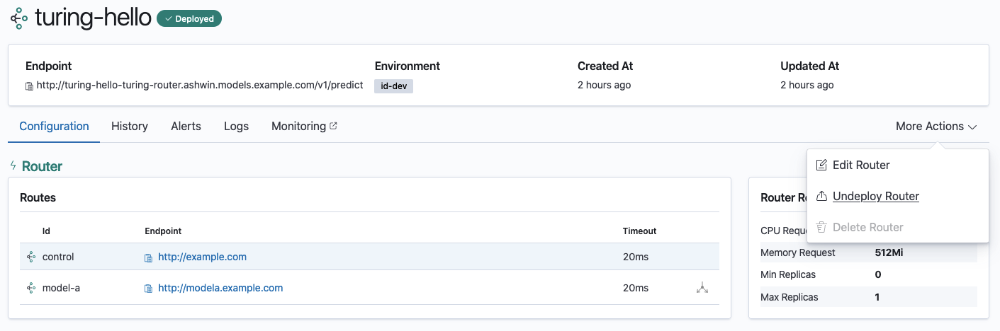
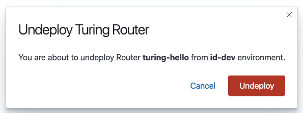

# Undeploying Router

Undeploying a router stops a deployed router and removes any resources deployed in the cluster for that router. This action is reversible and the router can be redeployed.

Navigate to the Router Details View of your router.

Click on the More Actions button and select Undeploy router. Only a **deployed** router, with the status badge `Deployed` can be undeployed.

Confirm if you want to undeploy your router.

Once the router has been successfully undeployed, you will see the status of your router has changed to `Not Deployed` and will no longer be monitored.
