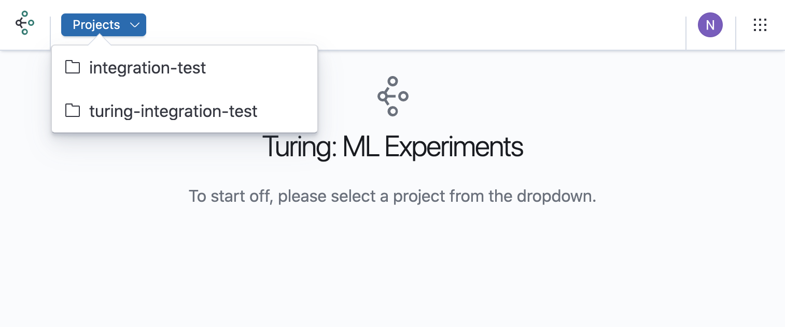

# View Router Details

Once the router has been created, you will be able to view the configuration of the deployed router version and other versions in the router.

### Navigate to Router Details

Open the Turing homepage.

Select the project in which the router was created.

Click on the row that contains the router.

You will now be able to see the Router Details View with details about the router.

    
**Name and Status Badge**: You will see the name of the router alongside a badge that indicates the status of the router deployment.

**Endpoint**: Dynamically generated URL to which users can send their experimentation requests.

**Environment**: The environment in which the router has been deployed.

**Created At**: This is when the first version of the router was created.

**Updated At**: This marks the latest occurrence of a different version being deployed to the router (either via Editing Router or Redeploying Router).
    
| Status     | Description | Badge |
| ---      | ---       | --- |
| Deployed | The configuration provided for the router is valid and has been successfully deployed. | 
| Not Deployed | There are no resources deployed in the cluster for the router.  | 
| Updating | The newly provided configuration for the router is being validated and will be deployed if valid. | 
| Failed | All configurations provided for the router are invalid and deployment has been unsuccessful. | 

There are 5 tabs that can be viewed in the homepage a more-actions button that will be explained more below. However we have omitted alerts and moniroting as there is no easy way to set those up. This feature will be added in a future release.





