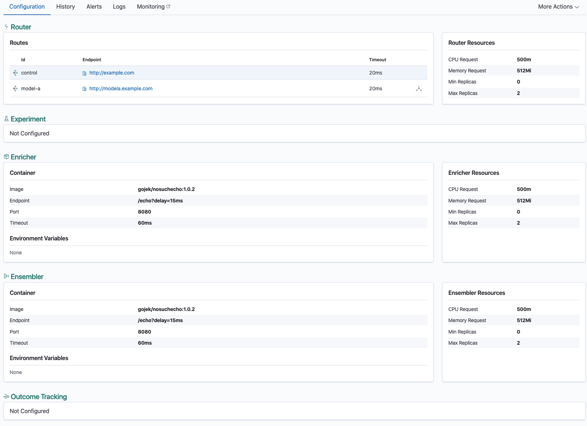
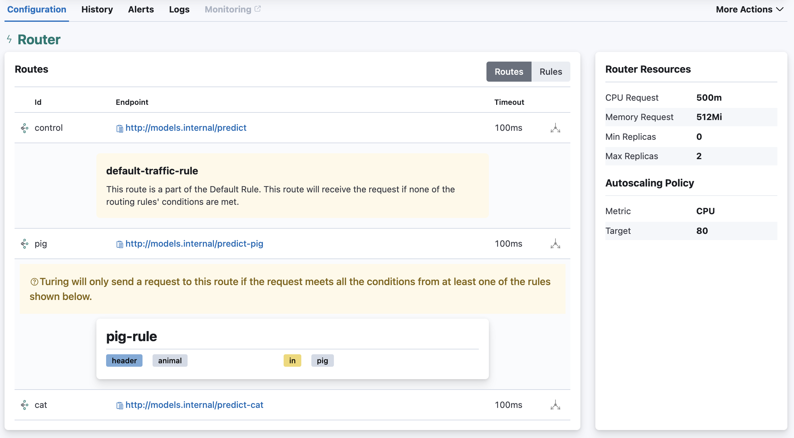
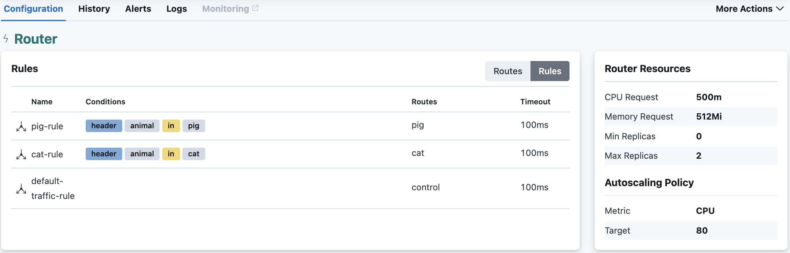

## Configuration

The configuration tab displays the configuration of the deployed version of the router. These values are either configured when creating a router or editing a router. 

  
  
If there are traffic rules (See: [Configure Traffic Rules](../create-a-router/configure-traffic-rules.md)) configured on the router, then you will see a  button next to the routes that are part of a traffic-split configuration. Click on the button to expand the row and see traffic rules and their conditions: 

Routes details panel also supports grouping by traffic rules, where you can easily see what traffic rule conditions have been configured for the Router.

