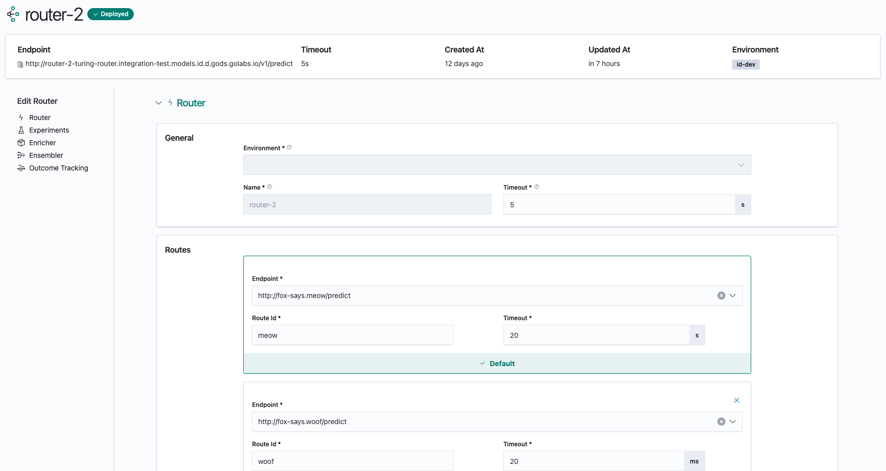
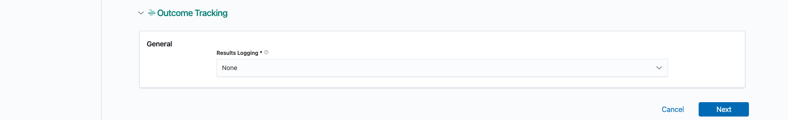
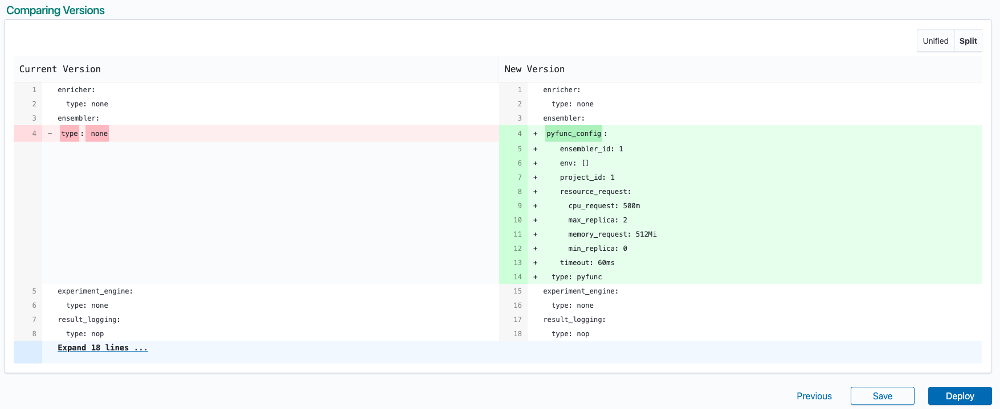

## Edit Router

Heading to the `Edit Router` page allows you to make changes to the configuration of the selected router. You  will 
be able to view panels corresponding to various components of a Turing Router.

Once you are done editing the configuration of your router, click on `Next` to proceed to the following step:

### Version Comparison

Clicking on next brings you to a version comparison page which shows the differences in the current router 
configuration as well as your proposed changes:

If you are content with the proposed changes and wish to proceed, there are 2 options available:
- `Save` your proposed changes
- `Deploy` your proposed changes

Saving your router simply creates a new router version without deploying the new configuration. Your existing router 
version remains active. You can visit the `History` tab to find the new router version that you have saved. Note 
that this new router version will be in a `Not Deployed` state.

Deploying a router will create a new router version **and** deploy the new version immediately. If the deployment is 
successful, instances of the router with the current version will be taken down and be replaced by the new version.

If you wish to make any additional changes instead, click on the `Previous` button. You will be returned to the 
previous page where you can continue making changes.