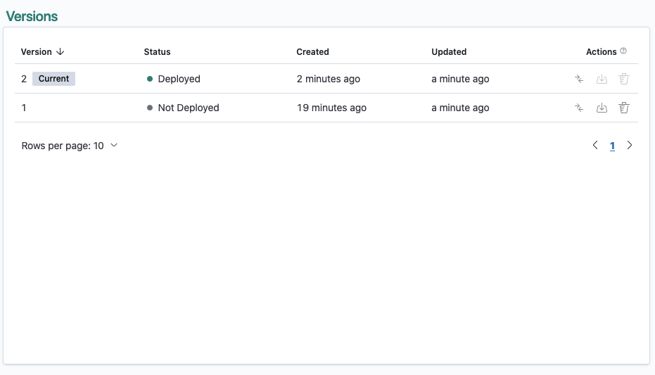
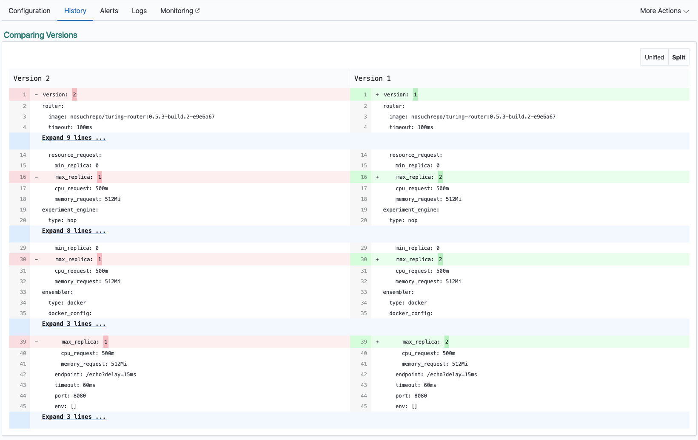
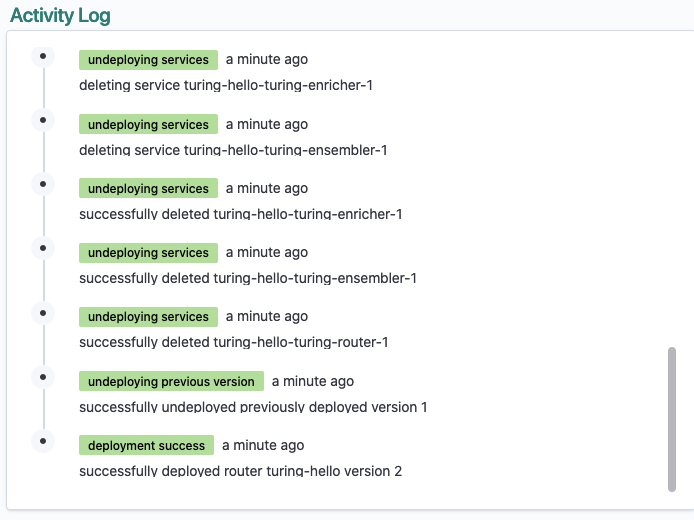

# History

The history tab displays all versions and activity log associated with the router.

### Versions

You will see a summary of each version being displayed.

**Version**: You will see the version number alongside applicable badges. There are 2 possible badges:

    * **Current**: Indicates the deployed version if the router is deployed or the latest deployed version if the router is undeployed.

    * **New**: Indicates if the version was created in the past hour

**Created**: This is when the router version was created.

**Updated**: This marks the latest occurrence of the router version being deployed (either when the version was created or when the version was redeployed).

**Actions**: Represents the actions that can be done to the router version:

    * **Compare**: It's possible to compare any two router versions to see what has been changed. See [Comparing Versions](./history.md#comparing-versions) 
      
    * **Deploy**: A router version which is not currently deployed can be deployed to the router. 

    * **Delete**: A router version which is not currently deployed can be deleted.

**Status**: Similar to the router status, there are 4 possible status values.

| Status     | Description | Badge |
| ---        | ---         | ---   |
| Deployed | The configuration provided in the router version is valid and currently deployed. |  |
| Not Deployed | The configuration provided in the router version is valid.  |  |
| Updating | The configuration provided in the router version is being validated and will be deployed to the router if successful. |  |
| Failed | The configuration provided in the router version is invalid. |  |

To view the configuration of the version in detail, proceed to you can click on the version to find out the details of that particular version.

### Comparing Versions

You can compare any two versions of router and check which part of the configuration has been changed. To do so, select two versions from the versions list and click on `Compare` button:

### Activity Log

The activity log displays information regarding the progress of the deployment and potential reasons of failed deployments.

