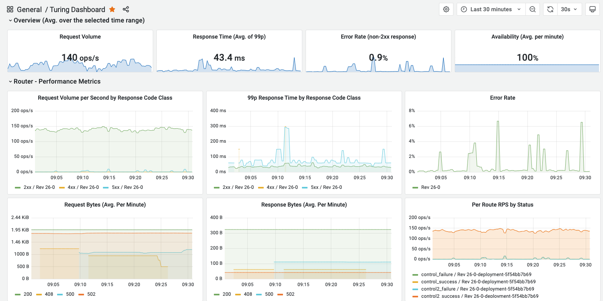

## Monitoring

The monitoring tab will bring you to the Grafana dashboard of the router. This dashboard displays information about the standard router metrics such as throughput, latency and error rate, to name a few. 

