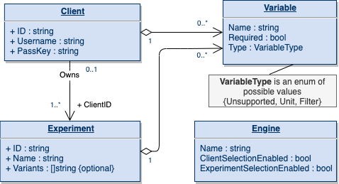
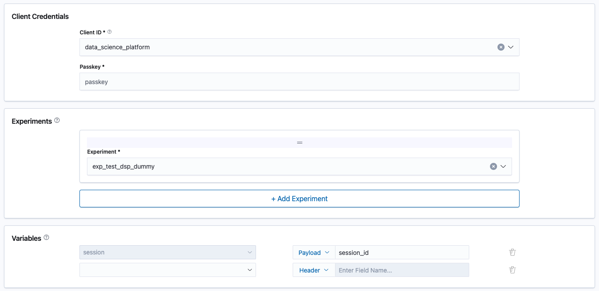

# Developer Guide

## Local Development

### Requirements
- Golang 1.18

## Adding a new Experiment Engine

Experiment Engines have 2 main responsibilities – management of experiments (to cater to requests such as list experiments, check if authorization is required to run experiments, etc.) and running experiments (this generates the Treatment for the given request). The former is used by the Turing app and the latter by the router. Thus, Experiment Engines for Turing must implement two interfaces, one for each type of functionality. 

### Experiment Manager

Experiment Managers in Turing can either be **Standard** or **Custom**.

Standard Experiment Managers can take advantage of the default user interface offered by Turing (for configuring and viewing experiment info in routers), by implementing the Standard APIs. In turn, these APIs constrain the engine to adhere to the concepts and terminology defined by Turing.

Custom Experiment Managers, on the other hand, have greater flexibility in all aspects. They are fully in control of how the data is stored in the DB, as well as how they are processed and applied to the routers and thus, are not required adopt the concepts defined by Turing. However, custom engines require that a user interface be implemented which can be invoked in appropriate workflows in Turing.

More details on the two types of managers are below.

#### Standard Experiment Manager

##### API
The experiment managers are required to implement the methods in the `StandardExperimentManager` interface. Not all methods in the interface may be required by all experiment engines. For example, an experiment engine that does not support authN/authZ need not implement `ListClients`. For this purpose, the `manager` package provides a `NewBaseStandardExperimentManager()` constructor to create a base experiment manager with default implementations, that can be composed into other concrete implementations of the interface.

The primary data types associated with the management of experiments may be visualized with the following UML diagram.



* **Engine** represents the properties of the experiment engine
* An **Experiment** may have an optional client. Experiments may be configured with a list of **Variants**.
* A **Client** may own 1 or more Experiments.
* Experiment **Variables** may be configured at the Client or Experiment level and may be required or optional. Turing currently supports 3 classifications for the variables, where distinguishing between the types are important.

Type        | Definition
------------|-----------
Filter      | This is used to filter the incoming request to decide whether or not it is in the experiment
Unit        | Experiment Unit(s) whose values, when varied, have an impact on the Treatment generated
Unsupported | The experiment engine does not distinguish between the variable types
* The **VariableType** is an enumeration and can be extended with other classifications in the future, if required.

##### UI

The `StandardExperimentManagerConfig` in the Experiment Engine properties will be used to populate the UI components for Client, Experiment and Variables configuration. For example, the client selection panel will only be displayed if `client_selection_enabled` is set to true.



#### Custom Experiment Manager

##### API
The experiment managers are required to implement the methods in the `CustomExperimentManager` interface. This is a lean interface with methods critical to the interaction between the Turing app and the router.

##### UI
The custom experiment manager should provide the following UI components for edit and view experiment engine configuration. The remote UI information should be set in `CustomExperimentManagerConfig` in the Experiment Engine properties.

```typescript
// IExperimentConfig below represents a serializable JSON dictionary object
type IJsonValue = string | number | boolean | null
   | IJsonValue[]
   | { [key: string]: IJsonValue };

type IExperimentConfig = { [key: string]: IJsonValue };

// EditExperimentEngineConfig component signature.
// config is {} on init.
// errors holds the validaton error(s), if any.
({
    projectId: number,
    config: IExperimentConfig,
    onChangeHandler: (React.ChangeEvent<HTMLInputElement>) => void,
    errors: yup.ValidationError,
}) => React.ReactElement

// ExperimentEngineConfigDetails component signature.
({
    projectId: number,
    config: IExperimentConfig
}) => React.ReactElement
```

In addition, custom experiment engines should also provide the following UI components to support the edit form and view 
configuration components for Standard Ensemblers (see
[this](../../../docs/how-to/create-a-router/configure-ensembler.md) for more details). The `routeNamePath` field 
should be configured to allow the Turing Router to access the route name from a treatment configuration received 
from the experiment engine. 

```javascript
// EditStandardEnsemblerConfig component signature
({
    projectId: int,
    routes: Array<Route>,
    routeNamePath: string,
    onChangeHandler: (React.ChangeEvent<HTMLInputElement>) => void,
    errors: yup.ValidationError,
}) => React.ReactElement

// StandardEnsemblerConfigDetails component signature.
({
    projectId: int,
    routes: Array<Route>,
    routeNamePath: string
}) => React.ReactElement
```

### Experiment Runner

Experiment runners are required to implement the methods in the `ExperimentRunner` interface. This interface contains a single method to retrieve the treatment for a given request.
