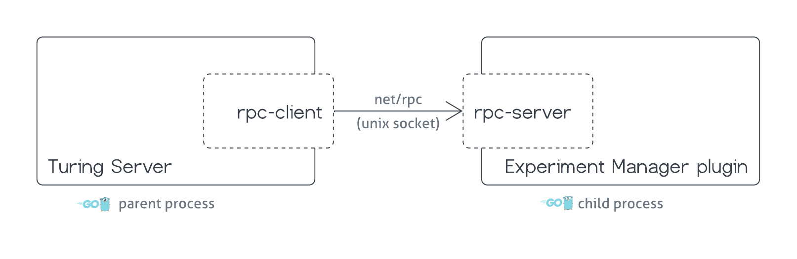
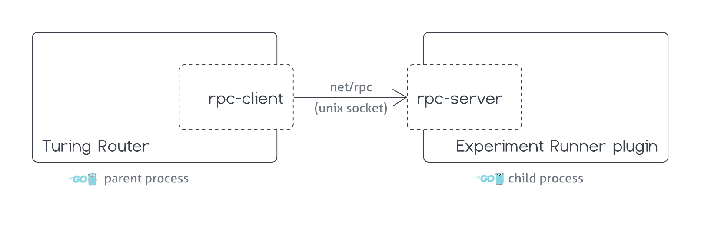

 # RPC Experiment Engine Plugins

It's possible to integrate external experiment engines with Turing by implementing experiment engine plugin 
and deploying it together with Turing app. Turing supports RPC experiment engine plugins via [Hashicorp go-plugin](
https://github.com/hashicorp/go-plugin) library.


## Implement a plugin

---
[Experiment Engine](./developer_guide.md#adding-a-new-experiment-engine) plugin serves the role of an adapter 
between the Experiment Engine backend and Turing Server/Turing Router. It's also possible to support an 
Experiment Engine, that doesn't have a backend at all. In this case, the plugin must implement the logic for 
managing experiments and assigning experiment treatments to requests internally.

Currently, Turing supports the Experiment Engine plugins written in Golang. Experiment Engine plugin is an 
executable Golang binary that is launched by the Turing Server/Router as a child process. Inter-process 
communication (IPC) between the parent (Turing Server/Router) and the child (Experiment Engine plugin) processes
is done through the local unix socket. For more information about the `hashicorp/go-plugin`'s internals, please 
check its [official documentation](https://github.com/hashicorp/go-plugin#readme).

For the correct work, the Experiment Engine plugin must implement both [Experiment Manager](developer_guide.md#experiment-manager)
and [Experiment Runner](./developer_guide.md#experiment-runner) interfaces.

Turing Server interacts with the Experiment Manager interface of the plugin to fetch the information about 
experiments configuration, which is used to deploy Turing router.


Turing Router interacts with the Experiment Runner interface of the plugin to "run" experiments and assign an 
experiment treatment to each incoming request to the router.


### Pre-requisites 
 * Golang 1.14
 * Git
 * Docker

### Implementation
This repository contains a simple serverless Experiment Engine plugin, which can be used as a reference for the plugin
implementation. 

First clone the Turing repo and change the workdir to the reference plugin root directory: 
```shell
$ git clone https://github.com/gojek/turing.git
$ cd turing/engines/experiment/examples/plugins/hardcoded
```

A Go plugin is a standalone application which serves the Experiment Engine implementation by calling 
`rpc.Serve(&rpc.ClientServices{})`. The entrypoint of the application is [`cmd/main.go`](../examples/plugins/hardcoded/cmd/main.go):

```go
package main

import (
	"github.com/gojek/turing/engines/experiment/examples/plugins/hardcoded"
	"github.com/gojek/turing/engines/experiment/plugin/rpc"
)

func main() {
	rpc.Serve(&rpc.ClientServices{
		Manager: &hardcoded.ExperimentManager{},
		Runner:  &hardcoded.ExperimentRunner{},
	})
}
```
Note that the main function is intentionally simplified to just a call to `rpc.Serve` function. It's entirely 
possible, that for the more complex plugin implementations it would be required to do some extra setup of the plugin 
before it gets served. 

All the bootstrapping code, required to serve the Experiment Engine plugin via the RPC, is provided by the Turing
library, which is added into the plugin module as the dependency in [`go.mod`](../examples/plugins/hardcoded/go.mod):
```shell
module github.com/gojek/turing/engines/experiment/examples/plugins/hardcoded

go 1.14

require github.com/gojek/turing/engines/experiment v1.0.0

replace github.com/gojek/turing/engines/experiment => ../../../
```
NOTE: Since this example plugin module and the `engines/experiment` library belong to the same repository, the plugin
resolves `engines/experiment` package locally and that's the reason why the `replace ...` line in added to the 
bottom of `go.mod`.

A plugin needs to serve the implementation of [Experiment Manager](./developer_guide.md#experiment-manager) (either 
[Standard](./developer_guide.md#standard-experiment-manager) or [Custom](./developer_guide.md#custom-experiment-manager)) 
and [Experiment Runner](./developer_guide.md#experiment-runner). 

#### Experiment Manager

Both Standard and Custom experiment managers should implement the `ConfigurableExperimentManager` interface of:
```go
// ConfigurableExperimentManager interface of an ExperimentManager, that can be configured
// with an arbitrary configuration passed as a JSON data
type ConfigurableExperimentManager interface {
    shared.Configurable
    manager.ExperimentManager
}
```

Which is composed of the `ExperimentManager` interface of:
```go
type ExperimentManager interface {
    // GetEngineInfo returns the configuration of the experiment engine
    GetEngineInfo() (Engine, error)
    
    // ValidateExperimentConfig validates the given Turing experiment config for the expected data and format
    ValidateExperimentConfig(cfg json.RawMessage) error
    
    // GetExperimentRunnerConfig converts the given config (as retrieved from the DB) into a format suitable
    // for the Turing router (i.e., to be passed to the Experiment Runner). This interface method will be
    // called at the time of router deployment.
    //
    // cfg holds the experiment configuration in a format that is suitable for use with the Turing UI and
    // this is the data that is saved to the Turing DB.
    //
    // In case of StandardExperimentManager, cfg is expected to be unmarshalled into TuringExperimentConfig
    GetExperimentRunnerConfig(cfg json.RawMessage) (json.RawMessage, error)
}
```
And `Configurable` interface of:
```go
type Configurable interface {
	Configure(cfg json.RawMessage) error
}
```
More details about the plugin configuration and the role of `Configurable` method in it can be found in the 
[Plugin Configuration](./rpc_plugins.md#experiment-manager-configuration) section.

Additionally, the Standard experiment manager should implement the StandardExperimentManager interface of:
```go
type StandardExperimentManager interface {
	ExperimentManager
	// IsCacheEnabled returns whether the experiment engine wants to cache its responses in the Turing API cache
	IsCacheEnabled() (bool, error)
	// ListClients returns a list of the clients registered on the experiment engine
	ListClients() ([]Client, error)
	// ListExperiments returns a list of the experiments registered on the experiment engine
	ListExperiments() ([]Experiment, error)
	// ListExperimentsForClient returns a list of the experiments registered on the experiment engine,
	// for the given client
	ListExperimentsForClient(Client) ([]Experiment, error)
	// ListVariablesForClient returns a list of the variables registered on the given client
	ListVariablesForClient(Client) ([]Variable, error)
	// ListVariablesForExperiments returns a list of the variables registered on the given experiments
	ListVariablesForExperiments([]Experiment) (map[string][]Variable, error)
}
```

A simple serverless `ExperimentManager` implementation, that receives the static experiment configuration 
at the initialization (via `Configure(...)` method) and serves this data to the Turing Server, can be found 
in the [`manager.go`](../examples/plugins/hardcoded/manager.go).

#### Experiment Runner

A plugin should also serve the implementation of ExperimentRunner, that implements `ConfigurableExperimentRunner` 
interface of:
```go
// ConfigurableExperimentRunner interface of an ExperimentRunner, that can be configured
// with an arbitrary configuration passed as a JSON data
type ConfigurableExperimentRunner interface {
	shared.Configurable
	runner.ExperimentRunner
}
```
Which is composed of the `ExperimentRunner` interface of:
```go
type ExperimentRunner interface {
	// GetTreatmentForRequest assigns a treatment to the given request
	GetTreatmentForRequest(
		header http.Header,
		payload []byte,
		options GetTreatmentOptions,
	) (*Treatment, error)
}
```
And `Configurable` interface of:
```go
type Configurable interface {
	Configure(cfg json.RawMessage) error
}
```
More details about the plugin configuration and the role of `Configurable` method in it can be found in the
[Plugin Configuration](./rpc_plugins.md#experiment-runner-configuration) section.

A simple `ExperimentRunner` implementation that assigns a treatment to the request based on the hardcoded experiment 
configuration and the traffic weights configured for each treatment can be found in the 
[`runner.go`](../examples/plugins/hardcoded/runner.go).

### Plugin Configuration

During the initialization, Turing Server/Router configures the plugin with the configuration data. 

#### Experiment Manager Configuration 

More specifically, Turing Server passes the arbitrary JSON configuration, defined in Turing [config file during 
the deployment](.#deployment), to the ExperimentManager's `Configure(cfg json.RawMessage) error` method. 
The specific implementation of the plugin can parse this JSON data into the expected data structure and use it 
to control ExperimentManager's logic. In the [provided example](../examples/plugins/hardcoded/manager.go), passed 
JSON configuration is parsed as an instance of [ManagerConfig](../examples/plugins/hardcoded/config.go), which 
consists of the engine metadata and a list of experiments that this Experiment Manager should be aware of: 

```go
func (e *ExperimentManager) Configure(cfg json.RawMessage) error {
	var config ManagerConfig

	err := json.Unmarshal(cfg, &config)
	if err != nil {
		return err
	}

	e.BaseStandardExperimentManager = manager.NewBaseStandardExperimentManager(config.Engine)
	e.experiments = make(map[string]Experiment)
	for _, exp := range config.Experiments {
		e.experiments[exp.Name] = exp
	}
	return nil
}
```
Example configuration of this ExperimentManager can be found in the [`configs/plugin_config_example.yaml`](../examples/plugins/hardcoded/configs/plugin_config_example.yaml).
Note that it's plugin's responsibility to set the expectations and define the contract for the plugin's configuration data.
It's also possible that Experiment Engine plugin does not require any external configuration. In this case, `Configure` 
method can be implemented as:
```go
func (e *ExperimentManager) Configure(json.RawMessage) error {
	return nil
}
```

#### Experiment Runner Configuration

Similarly to `ExperimentManager`, `ExperimentRunner` is also initialized with the configuration data passed 
into it by the Turing Router. The exact format of the `ExperimentRunner` configuration is defined by the specific 
implementation of the `ExperimentManager.GetExperimentRunnerConfig` method. In other words, the JSON data returned
by the `GetExperimentRunnerConfig` method of the `ExperimentManager` is passed into the `Configure` method of the 
`ExperimentRunner`. For example, if the ExperimentManager's `GetExperimentRunnerConfig` returns `{"foo": "bar"}`:
```go
type FooBarExperimentManager struct {}
    
func (*FooBarExperimentManager) GetExperimentRunnerConfig(cfg json.RawMessage) (json.RawMessage, error) {
	return json.RawMessage(`{"foo": "bar"}`), nil
}
```
then the same JSON data will be passed into the ExperimentRunner's `Configure` method as an argument during the plugin
initialization:
```go
type FooBarExperimentRunner struct {}

func (*FooBarExperimentRunner) Configure(cfg json.RawMessage) error {
	fmt.Println(string(cfg)) // ---> {"foo": "bar"}
	return nil
}
```

ExperimentRunner's configuration is stored in Turing database together with the rest of the Router configuration. I.e:

**Router Configuration Stage:**
  1. Turing Server calls `ExperimentEngine plugin`::`ExperimentManager`::`GetExperimentRunnerConfig` to retrieve  
     ExperimentRunner's configuration
  2. Turing Server saves this data into the database as part of the Router configuration 
     (`router_versions.experiment_engine`) 

**Router (Re-)Deployment Stage:**
  1. Turing Server retrieves Router's configuration from the Database
  2. Turing Server creates required resources in the k8s cluster (deployments, services, config maps and secrets)
  3. Turing Router is being deployed and during the initialization, it establishes the connection with the 
     ExperimentEngine plugin and passes the configuration into `ExperimentRunner`'s `Configure` method.

### Logging
In order for Turing Server/Router to include log messages from the Experiment Engine plugin, you can use 
`github.com/gojek/turing/engines/experiment/log` package:
```go
import (
	"github.com/gojek/turing/engines/experiment/log"
    _ "github.com/gojek/turing/engines/experiment/log/hclog"
)

type FooBarExperimentRunner struct {}

func (*FooBarExperimentRunner) Configure(cfg json.RawMessage) error {
	log.Infof("Configuration: %s", string(cfg))
	return nil
}
```
[`hashicorp/go-plugin`](https://github.com/hashicorp/go-plugin) uses [`hclog`](https://github.com/hashicorp/go-hclog) 
library for logging, and it expects that the plugin's log stream will be written into the standard output as `hlog` 
formatted entries. On other hand, Turing is relying on [`zap`](https://github.com/uber-go/zap) for logging, hence 
`turing/engines/experiment` module provides a bridge between `zap` and `hlog` libraries. By default, `zap` logger is
used for logging, so in order to enable `hlog` logger, it's required to import corresponding package for its 
side effect:
```go
import (
	_ "github.com/gojek/turing/engines/experiment/log/hclog"
)
```
Such import statement will configure `github.com/gojek/turing/engines/experiment/log` to use `hlog` logger with the 
default configuration. Alternatively, it's possible to configure `hlog` logger explicitly by calling `SetGlobalLogger`
function:

```go
package main

import (
     "github.com/gojek/turing/engines/experiment/examples/plugins/hardcoded"
     "github.com/gojek/turing/engines/experiment/log"
     "github.com/gojek/turing/engines/experiment/plugin/rpc"
     "github.com/hashicorp/go-hclog"
)

func main() {
     log.SetGlobalLogger(hclog.New(&hclog.LoggerOptions{
          Level:      hclog.Info,
          Name:       "example-plugin",
          JSONFormat: true,
     }))

     rpc.Serve(&rpc.ClientServices{
          Manager: &hardcoded.ExperimentManager{},
          Runner:  &hardcoded.ExperimentRunner{},
     })
}
```

## Packaging
`hashicorp/go-plugin` requires 100% reliable network for the communication between the host application and the 
plugin server, which is only possible with the local network. This means, that the location of the plugin's binary 
should be accessible from the host application and that both host app binary and plugin binary should be built for 
the same OS/architecture. For example, if the Turing Server/Router is built for macOS (Intel) (`darwin/amd64`) then 
the Experiment Engine plugin should be built for `darwin/amd64` too.

Turing is generally expected to be deployed as a container application and existing Turing releases are using 
`alpine` Linux distribution as a base image for running Turing Server/Router. So, in order to publish the Experiment
Engine plugin, which would be compatible with the pre-built Turing releases, the plugin's binary must be compiled for 
`linux/amd64` distribution too:
```shell
$ GOOS=linux GOARCH=amd64 \
    go build -o ./bin/example-plugin ./cmd/main.go
```

Then, since Turing is running inside a container, the plugin binary must be transferred into the same container 
before Turing's process is started. For production deployments, this is achieved with [`initContainers`](
https://kubernetes.io/docs/concepts/workloads/pods/init-containers/) and a shared `emptyDir` volume: 
 * The Experiment Engine plugin is packaged as OCI image and deployed with Turing as `initContainer`   
 * When deployed, the Experiment Engine image copies the plugin's binary into a shared volume accessible by the Turing app
 * Turing Server/Router process starts and launches the plugin as its child process

hence, it's expected that the Experiment Engine plugin is distributed as an OCI image (versioned and published into
the image registry) with its entrypoint/command being defined as:
```docker
CMD ["sh", "-c", "cp <path_to_plugin_binary> ${PLUGINS_DIR}/${PLUGIN_NAME:?variable must be set}"]
```
Note: Environment variables `PLUGINS_DIR` and `PLUGIN_NAME` combined define the path to where the plugin's binary 
should be copied. They are passed into the plugin's image at the deployment time.

The end-to-end example of a multistep Dockerfile, that builds the plugin's binary and then packages it according 
to the Turing contract can be found at [`Dockerfile`](../examples/plugins/hardcoded/Dockerfile).

Alternatively, you can use provided [`plugin.Dockerfile`](../plugin.Dockerfile) to package the plugin's binary:
```shell
# Build 
$ GOOS=linux GOARCH=amd64 go build -o ./bin/example-plugin ./cmd/main.go

# Package
$ docker build . \
  --build-arg=PLUGIN_BINARY=bin/example-plugin \
  --tag example-engine-plugin:latest \
  --file ../../../plugin.Dockerfile
```

## Deployment 

To deploy Turing with one or more Experiment Engine plugins, it's required to pass `turing.experimentEngines`
configuration when Turing is installed/upgraded from the [official Helm chart](../../../infra/charts/turing).

```yaml
turing:
  experimentEngines:
    - name: example-plugin
      type: rpc-plugin
      rpcPlugin:
        image: myrepo/example-engine-plugin:latest
      options:
        foo: bar
        bar:
          alice: bob
```
* `name` – (*required*) – experiment engine name
* `type` – (*required*) – experiment engine type. Currently, the only supported option is `rpc-plugin`
* `rpcPlugin.image` – (*required*) – image that contains plugin's binary. See [Packaging](.#packaging)
* `options` – (*optional*) – arbitrary YAML structure, that contains this plugin's configuration. 
              This data, serialized as JSON object will be passed into the [`ExperimentManager.Configure`](
              .#experiment-manager-configuration) method during the initialization stage.

Then this configuration can be used for the deployment. Check the helm chart [README.md](
../../../infra/charts/turing/README.md) for more details. 

This example experiment engine plugin is also used in the [Turing CI Pipeline](https://github.com/gojek/turing/actions/workflows/turing.yaml) 
and full deployment configuration of Turing with experiment engine plugin can be found at [infra/e2e/turing.values.yaml](
../../../infra/e2e/turing.values.yaml) 
