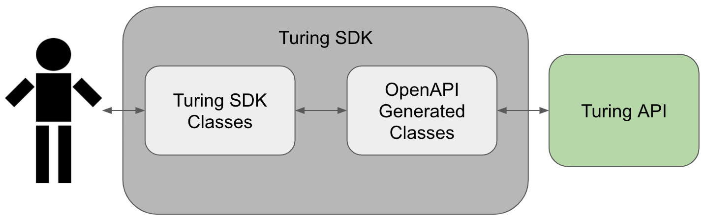

# Introduction
Turing SDK is a Python tool for interacting with Turing API, and complements the existing Turing UI available for 
managing 
router creation, deployment, versioning, etc. 

It aims to assist users in communicating with the API without having 
to manually build their own router configuration (which would normally be written in JSON), and also helps load JSON 
responses by the API into easily manageable Python objects.

By doing so, Turing SDK not only allows you to build your routers in an incremental and configurable manner, it also 
gives you the opportunity to write imperative scripts to automate various router modification and deployment 
processes, hence simplifying your workflow when interacting with Turing API.

## What is Turing SDK?
Turing SDK is entirely written in Python and acts as a wrapper, around the classes automatically generated (by 
[OpenAPI Generator](https://github.com/OpenAPITools/openapi-generator)) from the OpenAPI specs written for Turing API. 
These generated classes in turn act as an intermediary between raw JSON objects that are passed in HTTP 
requests/responses made to/received from Turing API.

While these auto-generated classes may appear sufficient for users to manipulate with, they expose unnecessary 
complexity to our users, especially the technical details of the underlying implementation of 
router configuration used by Turing API.

Hence, if you're someone who has used Turing/Turing UI and would like more control and power over router management, 
Turing SDK fits perfectly for your needs.

Note that using Turing SDK assumes that you have basic knowledge of what Turing does and how Turing routers operate. 
If you are unsure of these, refer to the Turing UI [docs](https://github.com/gojek/turing/tree/main/docs/how-to) and 
familiarise yourself with them first. A list of useful and important concepts used in Turing can also be found 
[here](https://github.com/gojek/turing/blob/main/docs/concepts.md). 

Note that some functionalities available with the UI are not available with Turing SDK, e.g. creating new projects.

## Samples
Samples of how Turing SDK can be used to manage routers can be found 
[here](https://github.com/gojek/turing/tree/main/sdk/samples).